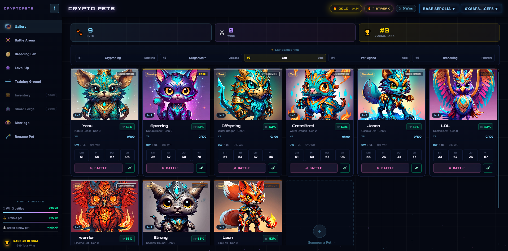

# CryptoPets 🚀

A Web3 pet-battling game running on both Ethereum and Solana. Breed, train, and
battle NFT pets whose art is generated from their on-chain DNA, with battle
outcomes resolved from a committed random beacon and published as signed
receipts anyone can replay.

**Live Demo:** https://cryptopets.vercel.app



## 📁 Project Structure

This is a monorepo containing multiple interconnected projects:

### Applications
- **[Frontend](./frontend)** - React + Vite web application with wallet integration
- **[Backend](./backend)** - Node.js + Express API server, battle authority, and settle keeper
- **[Mobile](./mobile)** - React Native cross-platform mobile app
- **[Website](./website)** - Next.js marketing/documentation site

### Smart Contracts & Blockchain
- **[Ethereum Contracts](./contracts/ethereum)** - Solidity smart contracts with Hardhat
- **[Solana Programs](./contracts/solana)** - Rust-based Solana programs with Anchor

### Services
- **[Indexer](./services/indexer-go)** - Go cross-chain indexer; the only writer of the pet roster
- **[Image Generator](./services/image-generator)** - Pet NFT art and ERC-721 metadata, from Cloudflare Workers AI

### Shared Code
- **[Shared Core](./shared)** - Common utilities, types, and hooks used across clients
- **[Protocol](./protocol)** - The battle protocol: combat engine, canonical encodings, hashes, seed derivation
- **[Verifier](./verifier)** - Standalone verifier that replays a signed battle receipt against the protocol

## 📖 Documentation

See [docs/](./docs) for the battle protocol, testing strategy, and an index of
all package-level docs. The component map and data flow live in
[CLAUDE.md](./CLAUDE.md#architecture).

## 🛠️ Development

See [DEVELOPMENT.md](./DEVELOPMENT.md) for:
- Setup instructions
- Available development commands
- Environment configuration
- Local blockchain setup (Ethereum + Solana)
- Building and testing procedures

## 🚀 Quick Start

```bash
# Install dependencies
pnpm install

# Start everything
pnpm dev
```

For detailed setup and commands, see [DEVELOPMENT.md](./DEVELOPMENT.md).

## 📚 Tech Stack

**Frontend:** React 19, TypeScript, Vite, Wagmi, Viem, TanStack Query

**Backend:** Node.js, Express.js, TypeScript, Prisma, PostgreSQL, GraphQL, JWT, Ethers.js, TweetNaCl

**Mobile:** React Native, TypeScript

**Services:** Go (indexer, gRPC), Cloudflare Workers AI + R2 (pet art)

**Blockchain:**
- Ethereum: Solidity, Hardhat
- Solana: Rust, Anchor

## 🤝 Contributing

See [CONTRIBUTING.md](./CONTRIBUTING.md) for setup, workflow, and pull request
guidelines. Please also review our [Code of Conduct](./CODE_OF_CONDUCT.md).

## 🔒 Security

See [SECURITY.md](./SECURITY.md) for how to report vulnerabilities.

## 📄 License

This monorepo uses two licenses depending on the package:

| Package(s) | License |
| --- | --- |
| `contracts/ethereum`, `contracts/solana`, `services/indexer-go`, `proto`, `protocol`, `verifier` | [MIT](./contracts/LICENSE) — fully permissive |
| `frontend`, `backend`, `mobile`, `website`, `shared`, `services/image-generator` (and anything else) | [PolyForm Noncommercial 1.0.0](./LICENSE) — free for any noncommercial purpose; commercial use requires permission |

`protocol` and `verifier` are MIT deliberately: a backend that decides battle
outcomes only holds up if outsiders can replay its receipts, which means the
verifier and everything it depends on has to be freely usable.

Each package's `package.json` / `go.mod` directory points at the license that
applies to it. For commercial licensing of the app layer, contact
[code@radcrew.org](mailto:code@radcrew.org).

---

**Built with ❤️ by the radcrew team**
