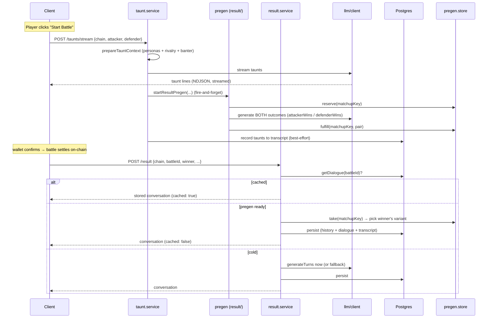

# Battle Dialogue

AI‑generated, in‑character conversation for PvP battles: **pre‑fight taunts** and
**post‑battle result banter**. The chain decides who wins; this feature only
*narrates toward* that outcome — it never determines it.

## The two phases

Dialogue has exactly two phases, mirrored everywhere (`DialoguePhase = 'taunt' | 'result'`):

| Phase | When | Endpoint | Keyed by |
|-------|------|----------|----------|
| **taunt** | "Start Battle" (before the wallet confirms) | `POST /api/battle-dialogue/taunts/stream` | matchup (no tx hash yet) |
| **result** | After the battle settles on‑chain | `POST /api/battle-dialogue/result` | `battleId` (tx hash / settle sig) |

They are two separate calls because they happen at fundamentally different times
and carry different data — at taunt time there is no `battleId` and no `winner`
yet; both exist only once the battle settles.

## Directory map

```
dialogue/
  dialogue.controller.ts   # HTTP handlers (the 3 routes above)
  dialogue.schema.ts       # zod request/response validation
  dialogue.types.ts        # types (inferred from the schemas)
  index.ts                 # public surface (what other features import)
  context.ts               # buildBanter / buildRivalry  (fetch history → render)
  recording.ts             # best-effort persistence (transcript + battle history)

  llm/                     # the model boundary — everything about talking to the LLM
    client.ts              #   request/stream taunts & dialogue (HF via the AI SDK)
    prompt.ts  persona.ts  #   prompt + persona building
    render.ts              #   render rivalry/banter context blocks
    fallback.ts            #   deterministic templated lines (no AI)

  taunt/
    taunt.service.ts       # streamTauntsConversation

  result/
    result.service.ts      # getOrGenerateDialogue (the settled-battle read)
    pregen.service.ts      # startResultPregen (warms both outcomes early)
    turns.ts               # generateTurns (AI-or-fallback) + ensureResultCoverage
    pregen.store.ts        # the pregen store (in-memory Map, or Redis)
```

Dependency direction (acyclic): `controller → {taunt, result} → {llm, context, recording}`;
`context → llm/render`. `llm/` depends on nothing internal — it's a swappable boundary.

## End‑to‑end flow



### 1. Taunt phase (`taunt/taunt.service.ts`)

`streamTauntsConversation`:

1. **Guard** — taunts are AI‑only (no templated fallback, by product choice). If
   `HF_API_TOKEN` is unset it throws → the route returns 502.
2. **`prepareTauntContext`** — builds both personas and, in parallel, the
   **rivalry** (head‑to‑head + recent form) and **banter** (recent lines between
   the pair) context blocks. `tauntsOnly: true` drops prior *result* lines so the
   model isn't primed to leak an outcome into pre‑fight trash talk.
3. **Generate** — `streamTaunts` (NDJSON, one `{turns}` snapshot per line, so the
   client reveals lines as they type).
4. **`persistTaunts`** — once the full set is in,
   append the taunts to the rolling transcript (`battle_conversation`,
   `battleId: null`) for future callback continuity, then fire‑and‑forget
   **`startResultPregen`** (below). Living here guarantees pregen fires on
   *both* paths.

### 2. Result pregen (`result/pregen.service.ts`)

The clever bit. At taunt time the winner isn't known, so we generate **both**
possible result conversations up front and stash them, keyed by **matchup**
(`chain:attackerId:defenderId`) since the tx hash doesn't exist yet.

- Starting at "Start Battle" (rather than at the tx hash) gives generation the
  whole **wallet‑confirm window** — important on fast EVM L2s where the
  hash‑to‑settle gap is too short for two LLM calls.
- The just‑shown taunts are passed in as `banterOverride`, so the result
  reactions continue from the exact lines the player saw (no DB round‑trip, no
  race against the taunt write).
- `leveledUp` is unknown pre‑settle, so both variants use `leveledUp: false`
  (minor flavor only).
- Lifecycle in the store: `reserve` (claim slot / dedup) → `fulfill` (publish the
  pair) → `take` (consume once) → `release` (on failure).

### 3. Result phase (`result/result.service.ts`)

`getOrGenerateDialogue` resolves the settled battle's conversation in priority order:

1. **Cache** (`battle_dialogue`, keyed by `battleId`) — if present, return it.
   This is the **generate‑once / idempotency** guarantee: the same battle always
   returns the same conversation across reloads, devices, and retries. (Old rows
   are patched on read via `ensureResultCoverage` without re‑saving.)
2. **Pregen** — `take(matchupKey)`; pick the variant matching the real `winner`.
3. **Cold generate** — `generateTurns` now (AI, or templated fallback on
   failure), then `ensureResultCoverage`.

Paths 2 & 3 then **`finalizeDialogue`**: record the battle to history (for future
rivalry context), `saveDialogue` (upsert), and append the result lines to the
transcript. History/transcript writes are best‑effort and never block the response.

## Cross‑cutting concerns

- **Resilience.** Context lookups and persistence are wrapped in `withFallback`
  (`@utils`) — they log and return a fallback instead of failing the response.
  Result generation falls back to deterministic templated lines (`llm/fallback.ts`)
  when AI is unavailable; taunts do not (AI‑only).
- **`ensureResultCoverage`.** The model sometimes writes only the winner's
  reaction; this guarantees *both* fighters get a result line by filling the gap
  from the fallback template.
- **Streaming.** `/taunts/stream` emits NDJSON; the client reads it incrementally
  (and falls back to the full body where streaming isn't supported, e.g. React
  Native).

## Configuration

| Env | Effect |
|-----|--------|
| `HF_API_TOKEN` | Enables AI. Unset → result uses templated fallback; taunts 502. |
| `HF_MODEL`, `HF_API_URL` | Model + endpoint overrides. |
| `REDIS_URL` | Pregen store backend. Unset → in‑process Map (single instance). Set → survives restarts / scales across instances (`pnpm add ioredis`). |

## Data stores

| Table | Role |
|-------|------|
| `battle_dialogue` | Generate‑once cache of the settled conversation, keyed by `(chain, battleId)`. |
| `battle_history` | Settled battles (winner mapped to pet id) → rivalry / recent‑form context. |
| `battle_conversation` | Append‑only transcript of all lines → replayed as banter into future prompts. |
