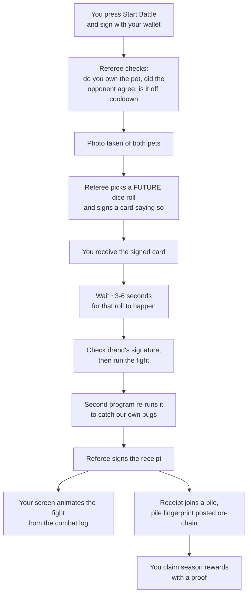

# The CryptoPets battle protocol

Status: implemented and live. This is the specification of the shipped system, not a proposal.
Where the text describes work as upcoming (§K, §L), read it as the record of how the migration
was sequenced.

This document has two halves and three appendices.

- **Part 1** explains the whole design in plain words, with no jargon. Read it even if you plan to
  read Part 2. It takes about ten minutes.
- **Part 2** is the precise specification: field lists, state machines, hash definitions, phases.
  Every section there starts with a one-line plain-words summary, so you can skim.
- **Appendix A** is the threat model, **B** the operations runbook, **C** the signing-key
  compromise procedure.

| If you want | Go to |
|---|---|
| To understand what we built and why | Part 1 |
| To evaluate the trust assumptions | Part 1, then §A trust model |
| To implement against it or verify a receipt | Part 2 |
| To attack it, or to review how we defend it | Appendix A |
| To operate it, or run a drill | Appendix B |
| To respond to a suspected key compromise | Appendix C |
| Unfamiliar word | Glossary at the end of Part 2 |

---

# Part 1: the whole idea, in plain words

## 1. What we want

Right now, every pet battle is a blockchain transaction. The blockchain rolls the dice, does the
fight math, and writes down who won.

That works, and it is very trustworthy, but it has three problems:

1. **It costs money.** Every single battle pays gas.
2. **It is slow to change.** The fight math is written four times: once in Solidity, once in Rust,
   once in Go, once in TypeScript. Changing one rule means changing all four and re-testing them
   against each other.
3. **It limits the game.** Team battles, equipment, and new skills all multiply that cost.

So we want to move the fight itself onto our own server. Battles become free and instant, and we
can add new mechanics without upgrading contracts on two blockchains.

## 2. The worry

If our server decides who wins, then our server could cheat.

It could make a favored player win. It could re-roll the dice until it liked the answer. It could
quietly delete a battle that went badly. Nobody outside the company could tell.

That is the entire problem this document solves. Everything below is a trick for making cheating
either impossible or *visible after the fact*.

Think of our backend as a **referee**. We are not asking players to trust the referee. We are
building a system where the referee has to show their work.

## 3. Trick one: take a photo before the fight

Before a battle starts, we write down exactly what both pets look like: level, stats, skills,
equipment. We freeze it. Call it the **photo**.

Why this matters: if we did the math later using live data, a pet could level up mid-fight and
change the answer. Worse, the referee could quietly adjust a stat. With a frozen photo, the fight
is decided entirely by things that were written down in advance.

## 4. Trick two: use dice nobody owns

The referee must not roll the dice, because a referee who rolls the dice can keep rolling until
they get the answer they want. Even a perfectly random roll is suspect if the roller can discard
it and roll again.

So we use somebody else's dice: a public service called **drand**. Picture a giant dice tower in a
public square that drops a new random number every three seconds, in front of everyone, forever.
Nobody owns it. Nobody can stop it or change it. Every roll comes with a signature proving it is
genuine, so you can check it yourself instead of taking our word for it.

Our battle uses one of those rolls.

## 5. Trick three: call the roll before it happens

This is the most important idea in the document, and it is the one the earlier draft got wrong.

Using public dice is not enough on its own. Imagine the referee watches the dice tower, sees the
3:00:06 roll, does the math, dislikes the result, and then says: "actually, this battle was always
going to use the 3:00:12 roll." Redo the math, get a nicer answer. Everything still looks
consistent. The public dice bought us nothing.

The fix: **the referee has to call the roll in advance, out loud, in writing.**

When you press Start Battle, the backend immediately:

1. takes the photo of both pets,
2. picks a roll that has not happened yet (say, two rolls from now),
3. signs a card that says *"battle #4821, these two pets, this photo, will use the 3:00:06 roll"*,
4. **hands you that signed card right away**, before 3:00:06 exists.

Now the referee is locked in. You are holding their signature. If they later claim a different
roll, you can produce the card, and their own signature proves they lied.

The earlier version of this plan only saved the chosen roll in our own database. That proves
nothing, because it is our database and we can edit it. The card has to leave our hands before the
dice land. That is the whole trick.

## 6. Trick four: hand out a receipt anyone can check

When the fight finishes, we give you a **receipt**. It is signed, and it contains everything:

- the photo of both pets,
- which dice roll was used, plus drand's own signature proving that roll is real,
- which version of the rulebook we used,
- what happened, and who won.

Here is the useful part. The fight math is a machine: same photo plus same dice plus same rulebook
always gives exactly the same result. Every time. On any computer.

So anyone can take a receipt, run the fight themselves, and check our answer. Not just us. Not
just partners. Anyone, including a suspicious player. We will publish a small program that does
exactly this.

This is what makes the referee honest in practice. We are not asking anyone to believe us. We are
publishing our homework with the working shown, and anyone can mark it.

## 7. Trick five: glue the receipts together

A dishonest referee could stop lying about results and simply *hide* a battle they did not like.

So receipts are numbered and glued: receipt 500 contains a fingerprint of receipt 499, which
contains a fingerprint of 498, and so on. Like pages sewn into a book instead of loose sheets. Tear
one out and the stitching is visibly broken.

We glue them twice: once in one long chain of every battle, and once per pet, so you can follow a
single pet's whole history without reading everybody else's.

That second chain exists for a specific reason. Once XP lives on our server instead of the
blockchain, you cannot check a pet's level by reading the blockchain. The only way to prove a pet
really was level 12 is to replay the battles that got it there. The per-pet chain is what makes
that possible to do quickly.

## 8. Prizes still go on the blockchain

Ordinary progression, XP and rating and win counts, stays on our server. It is cheap and it changes
constantly.

Real prizes are different, so they go back on-chain. Periodically we take a big pile of receipts
and squash them into one short fingerprint, called a **root**, and post that fingerprint publicly
on the blockchain. Later, a player claims their season rewards by showing a proof that their
receipt was inside that pile.

One transaction covers thousands of battles instead of one transaction per battle. That is the
saving.

## 9. What this still cannot do

Being honest about the limits is part of the design, so here they are.

- **If someone steals our signing key, they can sign lies.** We keep the key in a locked box (a
  hardware key service) that can only stamp battle receipts, and can never move money. That limits
  the damage. It does not eliminate it.
- **We could refuse to publish a battle at all.** The chains make it *visible*, not impossible.
- **The receipt proves what we published, not that we were honest.** Public replay is what catches
  dishonesty, and it only works if people actually run the checker. That is why we ship it early,
  publish the data, and monitor it ourselves.

If battles ever control serious money, this is not enough, and the design should move to
challenge-based or cryptographic proofs. That threshold should be decided deliberately, not drifted
past.

## 10. One battle, start to finish



The one step that can never be reordered is E before F. The signed card has to reach the player
before the dice land. Everything else can be retried, delayed, or recovered.

## 11. The five ideas, in one table

| Idea | Plain version | Stops |
|---|---|---|
| Photo | Freeze both pets before the fight | Editing stats after seeing the outcome |
| Public dice | Use drand, not our own randomness | Re-rolling until we like the answer |
| Signed card | Call the roll before it happens, hand it to the player | Claiming a different roll afterwards |
| Receipt + replay | Publish every input so anyone can redo the fight | Lying about the result |
| Glued receipts | Chain them so gaps show | Quietly deleting a battle |

---

# Part 2: specification

## §A. Trust model

> **In plain words:** we are not trustless. We are checkable. Here is exactly what you must trust
> and what you can verify yourself.

| Property | Who guarantees it | How you check it |
|---|---|---|
| Who owns a pet | The chain | Read the contract |
| Who owns a reward token | The chain | Read the contract |
| Which battles the operator claims happened | Operator signature | Verify against a published key |
| That a battle used the seed it claims | drand, plus the pre-commitment | Verify the beacon signature and your signed commitment |
| That the result is correct for those inputs | Nobody. It is recomputable | Re-run the ruleset and compare |
| That no battle was hidden | Nobody, fully | Hash chains make gaps visible, not impossible |

Three mechanisms carry the weight: commit before reveal (§E), public replay (§H), and receipt hash
chains (§G).

Not prevented, only bounded: a compromised signing key, and refusal to publish. Bounded by key
isolation, reward caps, inclusion monitoring, and emergency pause.

## §B. Why not keep battles fully on-chain

> **In plain words:** correctness is not the problem. Cost and rigidity are.

The current EVM flow in `contracts/ethereum/src/GameLogic.sol`: validate and snapshot both pets,
request Pyth Entropy, wait for the reveal, call `CombatSim.simulate`, write win/loss and XP and
cooldown and opponent history, emit `BattleResolved`. Solana mirrors this with Switchboard and
`settle_battle`.

Costs: gas per battle for randomness, simulation, and state writes; four coordinated ports per rule
change; and features like team battles multiply both.

Moving only the simulation off-chain while still settling each battle on-chain removes the
simulation cost but keeps per-battle gas. This design keeps routine progression off-chain and
settles only aggregated, valuable rewards.

## §C. Authority boundary

> **In plain words:** the chain owns things of value. The backend owns the game loop. Everything
> else is a cache and can be thrown away.

**On-chain authority:** pet and item ownership; NFT transfers and marketplace settlement; reward
custody; authorized batch roots; claims and nullifiers; emergency pause and signer governance.

**Backend authority:** matchmaking and challenge acceptance; backend-mode cooldowns; XP, rating,
win/loss, season progression; request-time snapshots; randomness-round commitment; combat execution
and logs; signed commitments and receipts; reward aggregation and proof generation.

**Non-authoritative projections:** WebSocket updates; cached roster and leaderboard responses;
animation state; Redis caches.

Postgres is the durable workflow ledger, but finalized on-chain ownership is the input authority.
The backend must be able to rebuild every projection from chain data, signed receipts, and batch
records.

## §D. Intent and consent

> **In plain words:** your wallet authorizes the battle, not a login token. And the defender agrees
> in advance so they can be challenged while offline.

### Signed battle intent

A JWT is fine for API access but is the wrong thing to authorize a battle, because it is a bearer
token we issued to ourselves. The wallet signs a canonical, expiring intent:

```text
schemaVersion
chainId
deploymentId
attackerOwner
attackerPetId
defenderOwner
defenderPetId
challengeId
clientNonce
rulesetHash
expiresAt
```

Requirements:

- EIP-712 typed data for EVM wallets; domain-separated sign-message format for Solana.
- Bind to `chainId` **and** `deploymentId`, so a staging signature cannot be replayed on production.
- Reject expired intents and consumed nonces.
- Require attacker ownership at the finalized source version.
- Never let a JWT user submit a battle for another wallet.

### Delegated signing (session keys)

The rule above is right and expensive: it puts a wallet prompt on the most repeated action
in the game. The resolution is *not* to accept a JWT after all, because the objection to a
JWT is not that it is inconvenient to check but that we mint it ourselves.

Instead the owner signs one `SessionDelegation` naming a key **the client generated and
holds**, and that key signs intents:

```text
schemaVersion
chainId
deploymentId
owner
sessionKey
scope               ('battle-intent')
notBefore
expiresAt
revocationNonce
```

What survives: the operator never sees the private key, so it still cannot produce an
intent. That is the entire property a JWT lacked. What changes is only how often a human is
asked.

Bounded on three axes, all enforced by the validator rather than trusted to the client:

- **Scope.** Battle intents alone. Defence consent is deliberately excluded — it is the one
  signature a defender relies on, and a stolen session key must not be able to produce it.
  Anything on chain is excluded by construction rather than by rule, since `equip` and every
  transfer check `msg.sender` and this key is not an account the chain knows.
- **Time.** `MAX_SESSION_SECONDS` (24h), so a client asking for longer is refused.
- **Revocation.** A nonce the owner bumps, plus `DELETE /api/battle/sessions`, which is
  unsigned for the same reason consent revocation is: the failure mode of an unauthorized
  revocation is more prompts, never fewer.

Not carried by any receipt, and that is a scoping decision worth stating. Public replay
never checks intent signatures, so delegation is an authorization gate rather than evidence.
Keeping it out of the signed record means the mechanism can be revised — or withdrawn —
without invalidating a single historical receipt.

The client stores the key in `sessionStorage`, not `localStorage`: per-tab and cleared on
close bounds a stolen copy to one browsing session, where persistent storage would turn one
XSS into weeks of authority. EVM only for now; a Solana player keeps the per-battle prompt,
because delegation needs the client to hold a key of the right family and the Solana signer
is the wallet adapter rather than a keypair this code owns.

### Standing defender consent

The current EVM contract lets anyone attack anyone's pet. Backend ranked mode should not apply
cooldown or rating changes to an unwilling defender. But requiring a live signature from the
defender would mean you can only fight players who are online, which is a large product regression.

Resolution: a long-lived `DefenseAuthorization`, signed once.

```text
schemaVersion
chainId
deploymentId
defenderOwner
petIds              (or "all pets I own")
rulesetHash         (consent is to a specific ruleset version)
minLevel
maxLevel
maxBattlesPerDay
notBefore
expiresAt
revocationNonce
```

Rules:

- Consent is per ruleset version, so a rules change invalidates outstanding authorizations. This
  prevents "I agreed to the old combat rules" disputes.
- Revocation is immediate, recorded in the ledger, with its timestamp in any affected receipt.
- Every receipt embeds the hash of the authorization it relied on.
- Live PvP is the same object with a short `expiresAt`.

This is a real design decision. Without it, backend ranked mode is online-only.

## §E. Randomness: commit before reveal

> **In plain words:** trick three from Part 1. Sign the chosen dice roll and give it to the player
> before that roll exists.

### Mechanism

1. On acceptance, mechanically choose a future round: current verified round plus a fixed offset.
   The offset is a constant, never a per-battle choice.
2. Persist the round, then **sign a `BattleCommitment` with the KMS key and return it in the accept
   response** to both players.
3. Wait for the round to publish.
4. Verify the drand BLS signature and chain hash.
5. Store the complete beacon proof in the receipt.
6. Derive the seed with domain separation:

```text
battleSeed = keccak256(canonical(
  "CRYPTOPETS_BATTLE_V1",
  chainId, deploymentId,
  drandRandomness,
  battleId,
  snapshotHash,
  rulesetHash
))
```

`canonical(...)` is the encoder in `protocol/src/encoding/writer.ts`: fixed-width integers, and a
4-byte length prefix on every variable-length element. Field order is as listed. This is not bare
`||` concatenation, and the difference matters: concatenated without prefixes, deployment `ab` with
battle id `c` produces the same preimage as `a` with `bc`, so a boundary an attacker can move is a
seed they can reach twice. `contracts/test-vectors/protocol-seed.json` carries that exact pair as a
case.

The tag is the version. A future derivation gets a new tag, which leaves every historical seed
derivable under the old one, so there is no schema-version field here.

Never derive randomness from timestamps, UUIDs, backend secrets, or a round chosen after its value
was known.

### Why the database row is not a commitment

Persisting the chosen round in Postgres proves nothing to anyone outside the operator, because the
database is the operator's. After seeing round R produce an unwanted result, the operator can claim
it committed to R+2, recompute, and every downstream artifact will be perfectly self-consistent and
wrong.

Merkle batching does not fix this, because batches anchor *after* computation. An anchor that
happens later is not a commitment.

The commitment must therefore leave the operator's control before the round publishes:

```text
BattleCommitment
  commitmentSchemaVersion
  battleId
  intentHash
  defenseAuthorizationHash
  snapshotHash
  attackerSnapshot
  defenderSnapshot
  rulesetVersion
  rulesetHash
  drandChainHash
  drandRound                <- future round, value not yet known
  acceptedAt
  previousCommitmentHash
  signingKeyId
```

Signed by the same KMS key family as receipts, returned synchronously in the accept response, and
served from a public endpoint. A dishonest reroll then requires a second signature over the same
`battleId`, which is self-incriminating if either player kept their copy.

Commitments carry their own hash chain, so the sequence of accepted battles is tamper-evident
independently of receipts.

### Latency budget

This architecture exists to serve a real-time battle UX, so the offset is a hard floor on
time-to-first-animation.

| drand chain | Round period | Offset of 2 rounds | Notes |
|---|---|---|---|
| Mainnet default | 30s | up to 60s | Too slow for interactive battles |
| Quicknet | 3s | up to ~6s | Viable; unchained, BLS signatures on G1 |

Recommendation: quicknet, offset 2 rounds, roughly 3 to 6 seconds from Start Battle to the first
animated strike. Comparable to the current on-chain entropy wait, so not a UX regression. Verify
current drand parameters and public keys before committing; treat these numbers as a starting
point.

The client must verify the BLS signature itself against a pinned public key. If it accepts our word
for the beacon value, commit-before-reveal buys nothing client-side. This needs a BLS12-381 verifier
in the browser bundle (for example `@noble/curves`). Confirm the bundle-size cost before locking in
drand.

### Failure and cancellation

- If the committed round cannot be fetched, **retry the same round indefinitely**. Never substitute
  a round whose value is known.
- On a permanent beacon outage past the defined timeout, the battle ends `forfeited` with no
  progression change, and both pets stay locked for a cooldown spanning several rounds. This stops
  players manufacturing outages to escape bad battles.
- **No player-initiated cancellation after `committed`.** This is a grinding defense. If abandoning
  a seeded battle were free, a player could submit many battles and keep only the good ones.
- Disconnection, tab close, and app kill are irrelevant to resolution. The client is a viewer of a
  result that will be recorded regardless.

## §F. Versioned deterministic combat

> **In plain words:** the fight math becomes a versioned, published rulebook, and we run a second
> copy to catch our own bugs.

`protocol/src/combat/` (moved out of `shared/src/utils/combat/`, which now re-exports it) becomes the
canonical computation path for backend and client replay.
Every battle records `rulesetVersion`, `rulesetHash`, the immutable skill/balance configuration,
the snapshot hash, the beacon proof, the derived seed, and the result plus combat-log hash.

### Workstream: port XP and progression to TypeScript

This is real work on the critical path, not a checklist item.

`protocol/src/combat/` today implements fight math only. There is no `xp.ts`. XP lives solely in
`services/indexer-go/internal/combat/xp.go`, and it depends on stateful inputs the current client cannot see:
`lastOpponentId` and same-opponent streak decay (`xp.go:32-41`). That is exactly why the TS port
stopped at fight math.

Under backend authority that state moves into `PetBattleProgress`, so it becomes portable:

1. Port `xp.go` to `protocol/src/combat/xp.ts`, reading streak state from the frozen snapshot
   rather than chain state.
2. Extend the snapshot to carry `lastOpponentId` and `streak` per pet, so progression is a pure
   function of the receipt's own inputs and stays independently replayable.
3. Add golden vectors for progression under the new snapshot shape, alongside
   `contracts/test-vectors/xp.json`.

Until this lands, the verifier cannot compare progression deltas and receipts cannot carry a
meaningful `progressionDelta`.

### What the Go verifier is for

Before signing, `services/indexer-go/internal/combat/` independently recomputes the result. TypeScript and Go
must match exactly on winner, round count, winner HP remaining, XP/progression delta, and
combat-log hash. Any mismatch stops receipt signing for that ruleset, alerts operators, retains both
outputs and all inputs, and never silently prefers one implementation.

**Be clear about what this buys.** Both ports descend from `CombatSim.sol`, are held in lockstep by
the same golden vectors, built by the same pipeline, and run by the same operator. The Go verifier
catches implementation drift, bad deploys, and transcription bugs. It does **not** constrain a
dishonest operator, who controls both processes. Its role is release safety.

The mechanism that constrains a dishonest operator is public replay (§H).

### Golden vectors

Keep the existing vectors in `contracts/test-vectors/`. Add vectors for intent hashing,
defense-authorization hashing, snapshot hashing, drand seed derivation, commitment hashing, receipt
hashing, progression calculation, and team-battle aggregation.

During migration, freeze Solidity and Rust combat as the legacy on-chain ruleset. New backend-only
mechanics require parity between the canonical TypeScript engine, the Go verifier, and client
replay. The existing four-port rule stays in force until the legacy path retires (§K).

## §G. Signed battle receipt

> **In plain words:** the permanent record. It holds every input, so anyone can redo the fight, and
> it links to the previous one so nothing can be quietly removed.

```text
receiptSchemaVersion                 <- header, written first
chainId
deploymentId
battleId
intentHash
commitmentHash
defenseAuthorizationHash
snapshotHash                         <- full snapshot travels in the payload
drandChainHash
drandRound
drandSignature
drandRandomness
seed                                 <- must follow from the fields above
rulesetVersion
rulesetHash
result
combatLogHash
progressionDelta
sequence
previousReceiptHash                  <- global chain, per signing key
attackerProgressPrevReceiptHash      <- per-pet chain
defenderProgressPrevReceiptHash      <- per-pet chain
createdAt
signingKeyId
```

Four notes where the implementation (`protocol/src/receipt/`) settled details this list left open.

**Header first.** Schema version, chain id, and deployment id precede the body in every hashed
object, so the shared prefix is defined once rather than copy-pasted per object. That moves
`battleId` after the header.

**The snapshot enters as `snapshotHash`.** Hashing the snapshots *and* their hash would bind the
same bytes twice. The full snapshot still travels in the payload, so replay needs nothing from us,
and `sourceChainVersions` is per pet inside it rather than a separate field.

**`seed` is recorded and checked.** Validation rejects a receipt whose seed does not follow from its
own domain, beacon, battle id, snapshot, and ruleset, which makes a favourable seed impossible to
staple onto a real beacon.

**`rewardDelta` is deferred.** Phase 3 receipts carry no transferable reward, and freezing the field
before the reward model exists would pin a layout to guesswork. Adding it in Phase 5 is a `receipt`
schema-version bump, which is what the version registry is for.

### Why three hash links

`sequence` alone is an ordering the operator asserts. The links make history tamper-evident.

- `previousReceiptHash` links every receipt under a signing key into one chain. Reordering or
  removal breaks it, and equivocation (two receipts claiming the same predecessor) becomes provable
  with two signatures.
- The per-pet links solve a subtler problem. Because XP and rating are off-chain (§C), a pet's
  snapshot is **not** verifiable against the chain. Confirming a pet really was level 12 requires
  replaying that pet's prior backend battles. Without a per-pet link that means scanning the whole
  ledger; with it, a verifier walks one pet's history directly.

This is what makes off-chain progression auditable rather than asserted, and it is what allows §H to
work at all.

### Encoding and signing

Encoding must be canonical. JSON property ordering is not sufficient unless canonical JSON is
explicitly implemented and tested. Prefer a fixed binary encoding or an EIP-712-compatible typed
hash.

Sign only the digest:

- Private key in a managed KMS/HSM, out of the API and worker environments.
- No asset custody, no withdrawal authority.
- Separate keys for EVM and Solana reward domains. Implemented as one signer backend per
  chain family: the key is chosen by the *object's own* domain, never by a caller argument,
  so nothing can sign an EVM receipt with the Solana key. A deployment serving one family
  needs one key — there is nothing to separate — but one serving both must name a key for
  each, and the signer refuses to start rather than let them collapse onto one. Both keys
  are published together, and a verifier matches on `signingKeyId` without needing to know
  how they are partitioned.
- Publish public keys and validity periods; retain rotated-out keys. `notAfter` is stamped
  automatically at the first boot that no longer configures a key, and is dated from
  evidence rather than the clock: the `createdAt` of the last receipt that key actually
  signed. That is the strongest claim the data supports and it is safe in the direction that
  matters, since every receipt the key legitimately produced is at or before it — stamping
  can never retroactively invalidate one. A key that signed nothing gets a zero-length
  window, which is the honest description of one configured and never used. An end recorded
  deliberately, such as during a compromise, is never overwritten by a later boot's guess.
- Log every KMS request, digest, result, and key version.
- Signer accepts only the exact commitment and receipt schemas. Never expose a generic
  state-mutation signing endpoint.
- Signer requires matching attestations from the TypeScript engine and the Go verifier.

## §H. Public replay

> **In plain words:** trick four. This is the thing that actually keeps us honest, so it is a
> deliverable, not a bullet point.

Because the receipt carries every input, any third party can recompute the fight and compare. Ship:

1. **A standalone verifier binary.** Minimal dependencies, no backend access, no database. Input: a
   receipt or a range of receipts. Output: pass/fail per check, covering signature validity, drand
   BLS signature, seed derivation, combat replay, progression, hash-chain continuity, and Merkle
   inclusion.
2. **Pinned ruleset artifacts.** Each `rulesetVersion` published as an immutable, content-addressed
   bundle so historical battles reproduce exactly.
3. **A public receipt corpus.** Paginated export by pet, by wallet, and by sequence range, so replay
   needs no special access.
4. **Published signing keys** with validity periods, including rotated-out keys.

Licensing note: outsiders are expected to run this, so it cannot live under `backend/` (PolyForm
Noncommercial). See §K.

## §I. Merkle batches and reward claims

> **In plain words:** trick five. Squash thousands of receipts into one fingerprint, post that
> on-chain, and let players claim rewards with a proof.

Normal battles send no transactions. A batcher periodically aggregates signed receipts. Each
per-chain batch commits:

```text
batchNumber
previousRoot
merkleRoot
rulesetSetHash
firstSequence
lastSequence
createdAt
```

A minimal root-registry contract/program stores accepted roots. A separate claim path verifies
Merkle proofs for aggregate season rewards.

Claims must bind: chain and root registry; season/batch; wallet beneficiary; reward asset and
amount; unique claim/nullifier ID; Merkle root.

Security limits: cap reward value per battle, wallet, batch, and season; enforce one-time claims;
support emergency pause; rotate root publishers through multisig and timelock; alert when signed
receipts are omitted beyond the inclusion SLO; publish receipt-to-root inclusion proofs.

Merkle anchoring makes publication immutable. It does not prove honest computation (that is §H) and
it does not force inclusion. An unanchored signed receipt is evidence of operator failure, not an
on-chain claim. If omission risk becomes unacceptable, add a delayed direct-receipt claim fallback
or an optimistic challenge protocol.

Implement the EVM registry and claim path first. Port to Solana only after operating the EVM version
successfully.

## §J. Ledger, delivery, and recovery

> **In plain words:** the database is the source of truth for battles in flight; the WebSocket is
> just a notification and must stop broadcasting everything to everyone.

### Durable state machine

Add explicit Prisma models rather than treating `BattleHistory` as the workflow: `BattleIntent`,
`DefenseAuthorization`, `BattleLedger`, `BattleCommitment`, `BattleReceipt`, `BattleBatch`,
`BattleRuleset`, `PetBattleProgress`, `BattleOutbox`.

```text
accepted
  -> committed          (round chosen, commitment signed and delivered)
  -> seeded             (round published, signature verified, seed derived)
  -> computed
  -> verified
  -> signed
  -> published
  -> batched
```

Failure transitions:

```text
rejected              (validation failed, before any commitment)
expired               (intent expired before acceptance)
verification_failed   (engine/verifier mismatch, circuit breaker trips)
signing_failed
forfeited             (see §E)
```

`rejected` exists only before `committed`. Once committed, a battle resolves.

Requirements:

- Wallet-provided idempotency nonce with a unique database constraint.
- Lock both pets in deterministic ID order inside a serializable transaction.
- Validate ownership, readiness, level band, consent, and snapshot source version.
- Persist the complete immutable snapshot **before** randomness exists.
- Commit each state transition and its outbox message atomically.
- Process jobs at least once; every transition idempotent.
- A duplicate battle ID with a different payload is a security alert, never an upsert.
- Append-only audit events for every transition.

### The WebSocket

`backend/src/ws/liveBattleSocket.ts` currently broadcasts every message to every connected client,
deliberately, because clients filter by `(chainId, requestId)` themselves and the payload was
chain-derived data anyone could read anyway.

That stops being acceptable here, because the payload now carries the full combat log. A global
broadcast would tell every connected client the outcome of every battle as it resolves.
`BattleRoom` already exists in Prisma and `battle-room.service.ts` already mints room IDs, so scope
subscriptions to the room.

Two changes: **notification-only** (never authoritative, always re-fetchable) and **per-room**
(never global).

### Required APIs

Create/accept battle intent (returns the signed commitment); get battle state by ID; get signed
commitment; get signed receipt; get combat log; get batch and Merkle proof; get active signing keys
and rulesets; verify-receipt endpoint alongside the standalone verifier.

### Frontend behavior

1. Submit the signed intent.
2. Store the battle ID **and the signed commitment** locally. The commitment is the player's own
   evidence, so it must survive a reload.
3. Subscribe to the room's WebSocket for responsiveness.
4. Poll or refetch the authoritative endpoint after reconnect.
5. Verify the receipt signature, the drand BLS signature, and the hash links.
6. Replay the combat log and animate.
7. Show batch inclusion and reward-claim status as separate, later states.

### Operations

Postgres point-in-time recovery with tested restores; dead-letter queue for exhausted jobs; multiple
stateless compute workers; independently deployed verifier; protected signer with minimal network
access; structured logs and metrics; reconciliation between finalized chain ownership, snapshots,
receipts, and claims.

Alert on: engine/verifier mismatch; repeated nonce; unsigned or unbatched backlog; drand fetch
delay; commitment delivery failure (accept succeeded but the player never received a signed
commitment); root-anchor delay; receipt omission; hash-chain discontinuity; unusual win
distribution; reward-cap violation; signer use outside expected throughput.

### Threats and controls

Threats: compromised API or database; compromised signing key; dishonest operator; randomness reroll
after seeing the value; outcome grinding by repeated submit-and-abandon; intent replay;
cross-chain or cross-deployment replay; duplicate workers; stale ownership after NFT transfer;
concurrent battles with the same pet; forged equipment snapshots; forged defender consent;
denial-of-service against popular opponents; fraudulent or omitted reward batches.

Controls: domain-separated intents, commitments, and receipts bound to `chainId` + `deploymentId`;
nonce uniqueness and expiry; signed pre-commitment delivered before reveal (§E); no cancellation
after `committed` (§E); finalized ownership checks; deterministic row locking; immutable snapshots;
standing consent with revocation, hashed into the receipt (§D); per-wallet and per-pet rate limits;
daily battle and reward limits; separate compute, verify, and sign roles; circuit breaker on any
mismatch; public replay tooling (§H); capped on-chain economic exposure; emergency pause for roots
and claims.

## §K. Repository changes this requires

> **In plain words:** two existing rules in this repo conflict with this plan, and one of them is a
> licensing problem that has to be settled before code is written.

### Rules and docs

The four-port combat rule is a `MUST` in `AGENTS.md`, restated in `CLAUDE.md`. It is not merely
roadmap guidance, so accepting this document does not relax it. Amend both files **at Phase 6**,
when the legacy on-chain path actually retires, not at acceptance.

**Done.** The amendment split the four ports rather than loosening the rule: `CombatSim.sol`
and `combat.rs` are now `MUST NOT` change — frozen, because the battles they settled are permanent
records that must stay replayable — while `protocol/src/combat/` and `services/indexer-go/internal/combat/`
are `MUST` change together, since §F's circuit breaker depends on the two being independent. All four
golden-vector suites keep running: the frozen pair proves the vectors still describe what settled on
chain, the live pair proves the current engine has not drifted from it.

Update `docs/plan-future-features-roadmap.md` on acceptance:

- Replace team battles that repeatedly call on-chain `CombatSim` with backend orchestration over a
  versioned ruleset.
- Remove the claim that team battles are inherently low risk. Authorization, snapshots, seed
  commitment, signer scope, and reward aggregation are all security-sensitive.
- Change equipment guidance: backend combat needs no Solidity/Rust implementation per new rule, but
  equipment ownership and accepted-battle snapshots must stay verifiable.
- Treat the settle keeper as legacy for battle execution.
- Correct stale dual-indexer descriptions if `indexer-go` remains the only active writer.
- Keep stories and AI narrative content out of combat inputs.

### Licensing placement

`contracts/ethereum`, `contracts/solana`, `indexer-go`, and `proto` are MIT; everything else is
PolyForm Noncommercial.

- Root registry and claim contracts land in `contracts/ethereum`, so MIT, no action needed.
- **The standalone public verifier (§H) cannot live under `backend/`.** A verifier outsiders are
  expected to run must be licensed so they can run it. Decide its home before writing it: an MIT
  top-level package such as `verifier/`, or extend the MIT Go combat package in `indexer-go`.

## §L. Migration and implementation order

> **In plain words:** do not turn off the on-chain path first. Build the checkable parts before
> anything of value is at stake.

### Phases

**Phase 1, specification.** Freeze canonical encodings (intent, consent, snapshot, seed, commitment,
result, receipt, Merkle leaf). Write the threat model and key-compromise runbook. Decide which
progression is off-chain and which rewards are claimable. Decide consent and matchmaking rules.
Confirm drand chain, offset, and browser BLS cost.

**Phase 2, XP port and shadow computation.** Port XP/progression to TypeScript (§F) with golden
vectors. Keep normal on-chain battles running. Compute every settled battle through the backend
engine, verify with Go, compare against `BattleResolved`. Require zero deterministic mismatch over a
defined observation window.

**Phase 3, rewardless backend battles.** Separate backend battle mode alongside the on-chain one.
Off-chain XP/rating/cooldown stored distinctly from NFT state. Signed commitments and receipts with
no transferable reward. **Ship the standalone verifier and receipt corpus in this phase**, not
later: public replay needs exercising while nothing of value is at stake. Drill recovery, replay,
key rotation, and incident response.

**Phase 3.5, optional: per-battle on-chain settlement.** If per-battle XP must stay NFT state, stop
here. A backend-signed result verified by the contract keeps chain state authoritative and removes
only the simulation cost. It still pays per-battle gas, so it does not reach this document's goal,
but it is strictly safer and is a legitimate end state, not merely a stepping stone.

**Phase 4, anchored batches.** Deploy the EVM root registry and capped claim contract. Anchor
low-value test batches. Publish proofs and independent verification tooling. Monitor omissions,
mismatch rates, operational lag.

**Phase 5, bounded rewards.** Conservative aggregate season rewards with per-wallet, per-batch, and
global caps. Solana only after the EVM receipt and operations model is stable.

**Phase 6, deprecate per-battle settlement.** Only after stable operations and an external security
review. Keep legacy receipts and events replayable. Never represent off-chain XP as NFT state unless
a successful aggregate claim applied it on-chain.

### Build order

1. Threat model and canonical schemas.
2. Transactional ledger and signed-intent API.
3. Standing defender consent.
4. drand commitment, signed `BattleCommitment` delivery, beacon verification.
5. XP/progression port to TypeScript with golden vectors.
6. Canonical TypeScript execution and independent Go verification.
7. Isolated KMS signing for commitments and receipts.
8. Receipt hash chains and public receipt corpus.
9. Standalone verifier binary and pinned ruleset artifacts.
10. WebSocket scoped per room and made non-authoritative.
11. Shadow current on-chain battles.
12. Launch rewardless backend battles.
13. EVM Merkle root registry and capped aggregate claims.
14. Security review and operational drills.
15. Enable bounded rewards.
16. Port the proven root/claim interface to Solana.

## §M. Approaches intentionally deferred

> **In plain words:** four other ways to solve this, and why each is wrong for now.

**Fully centralized, unsigned backend.** Easy to build; weak auditability, poor key separation, no
durable player proof. Non-economic prototypes only.

**Per-battle backend signature settled on-chain.** Chain state stays authoritative and the contract
verifies every outcome, but every battle still costs gas. See Phase 3.5.

**Optimistic settlement.** Reduces trust with bonded proposals and challenge windows, at the cost of
watcher liveness, griefing vectors, and more complex contracts. Reconsider when battle value
justifies it.

**Zero-knowledge proof.** Strong correctness, but requires circuit authoring, proving
infrastructure, and careful version upgrades. Disproportionate for the current product stage.

**State channels, rollup, or appchain.** Adds sequencer, bridge, data-availability, and operational
risk well beyond the battle problem. Not worth introducing solely to reduce combat gas.

---

## Glossary

| Term | Meaning here |
|---|---|
| **Intent** | A wallet-signed, expiring request to fight. Permission, not a result. |
| **Standing consent** | A defender's long-lived signed permission to be challenged, so battles work while they are offline. |
| **Snapshot** | The "photo": both pets' stats frozen at acceptance, before randomness exists. |
| **drand** | A public randomness service that publishes a signed random number on a fixed schedule. Nobody here controls it. |
| **Beacon round** | One tick of drand, identified by number. Round 12345 has exactly one value, forever. |
| **Commitment** | Our signed statement of which future round a battle will use, handed to players before that round exists. |
| **Seed** | The number derived from the beacon value that drives the fight's randomness. |
| **Ruleset** | A versioned, content-addressed bundle of combat rules and balance config. Battles record which one they used. |
| **Receipt** | The signed permanent record of one battle, containing every input needed to recompute it. |
| **Hash chain** | Each receipt referencing its predecessor, so deletion or reordering is detectable. |
| **Public replay** | Anyone re-running a battle from its receipt and checking our answer. |
| **KMS / HSM** | The locked box holding the signing key. It can stamp receipts and nothing else. |
| **Merkle root** | One short fingerprint standing for a whole pile of receipts, posted on-chain. |
| **Merkle proof** | The short evidence that your receipt was in that pile. |
| **Nullifier** | A one-time marker preventing a reward from being claimed twice. |
| **Equivocation** | Signing two conflicting statements about the same battle. Provable cheating. |

---

# Appendix A: threat model

Scope: the backend battle path specified in Part 2 above. The existing on-chain path
(`GameLogic.sol`, `settle_battle.rs`) keeps its own properties and is not re-analysed here.

This appendix exists because moving battle resolution off-chain moves it inside our trust
boundary. §A states the trust model in one table; this is the expanded version: who attacks
what, what stops them, how we notice, and what is left over.

## 1. Assets

| Asset | Why it matters | Authority |
|---|---|---|
| Pet and item ownership | Transferable value | Chain |
| Reward custody and claims | Transferable value | Chain |
| Battle signing key | Signs commitments and receipts; forgery source | KMS |
| Root publisher key | Anchors batches on-chain | KMS + multisig |
| Off-chain progression (XP, rating, streak) | Determines rewards and matchmaking | Backend |
| Signed receipt corpus | The evidence players hold against us | Backend, published |
| Commitment sequence | Proves which round each battle was bound to | Backend, delivered to players |

## 2. Actors

| Actor | Assumed capability |
|---|---|
| Player | Can sign with their own wallet, replay traffic, script requests, disconnect at will |
| External attacker | Network position, can hit any public endpoint, no keys |
| Insider with database access | Read and write Postgres, no KMS signing scope |
| Insider with signer access | Can request signatures over well-formed commitments and receipts |
| Dishonest operator | Controls all backend processes, both combat implementations, and the database |
| drand network | Assumed honest and live; a threshold of nodes would have to collude to bias a round |

The dishonest-operator row is the uncomfortable one and it is deliberate. Most controls below do not
stop that actor. They make the actor's lies detectable by anyone holding a commitment or a receipt.

## 3. Threats

Each row: what the attacker does, what stops or bounds it, how we notice, what is left.

### T1: randomness reroll after seeing the value

- **Attack.** Operator watches drand, computes the result, dislikes it, and claims the battle was
  always bound to a later round. Recompute, publish, everything self-consistent.
- **Control.** Commit before reveal (§E). The round is chosen mechanically as
  `currentVerifiedRound + 2`, and the signed `BattleCommitment` is returned synchronously in the
  accept response, before the round exists.
- **Detection.** A reroll needs a second signature over the same `battleId`. Either player's stored
  commitment plus the published receipt is a provable equivocation.
- **Residual.** Only detectable if players keep their commitment. The client persists it to local
  storage and the endpoint serves it, but a player who never fetched it holds no evidence.
- **Non-control.** Persisting the chosen round in Postgres proves nothing. It is our database.
  Merkle anchoring does not help either, because anchoring happens after computation.

### T2: lying about the result

- **Attack.** Publish a receipt whose winner does not follow from its own inputs.
- **Control.** None preventive. The receipt carries every input, so the result is recomputable.
- **Detection.** Public replay (§H). Anyone runs the verifier and the check fails.
- **Residual.** Only caught if someone runs the verifier. That is why it ships in Phase 3 while
  nothing of value is at stake (Steps 30 to 32), and why we run it in CI against a corpus fixture
  and monitor it ourselves.

### T3: hiding a battle

- **Attack.** Resolve a battle, dislike the outcome, never publish the receipt.
- **Control.** None preventive. Receipts are sequenced and hash-chained globally and per pet (§G).
- **Detection.** A gap breaks the chain. The per-pet chain also means a player who holds their own
  commitment can show a committed battle with no corresponding receipt.
- **Residual.** Visible, not impossible. If omission risk becomes unacceptable, §I's delayed
  direct-receipt claim fallback or an optimistic challenge protocol is the next step.

### T4: signing-key compromise

- **Attack.** Stolen key signs arbitrary commitments and receipts.
- **Control.** Key in KMS, never in API or worker environments. Signer accepts only the exact
  commitment and receipt schemas, never a generic state-mutation payload. No asset custody, no
  withdrawal authority. Separate keys per reward domain. Reward caps bound the economic damage
  (§I).
- **Detection.** KMS request logging of every digest and key version. Signer throughput outside
  expected range. Receipts that exist in the corpus but not in the ledger. Hash-chain forks.
- **Residual.** Real. Bounded, not eliminated. See
  Appendix C.

### T5: outcome grinding by submit-and-abandon

- **Attack.** Submit many battles, abandon the ones that seed badly, keep the good ones.
- **Control.** No player-initiated cancellation after `committed` (§E). Disconnection, tab close,
  and app kill do not affect resolution. Per-wallet and per-pet rate limits, daily battle caps.
- **Detection.** Abandonment rate per wallet. Win distribution per wallet against the expected
  distribution for their matchups.
- **Residual.** A player can still choose which opponents to fight. That is matchmaking design, not
  a randomness leak.

### T6: manufactured beacon outage

- **Attack.** Player degrades their own connectivity, or an attacker degrades ours, to escape a
  battle already seeded against them.
- **Control.** The committed round is retried indefinitely and never substituted. On a genuine
  permanent outage past the timeout, the battle ends `forfeited` with no progression change and both
  pets stay locked for several rounds, so escaping costs more than losing (§E).
- **Detection.** drand fetch delay metric. Forfeit rate per wallet.
- **Residual.** A wallet that repeatedly forfeits is a rate-limit and abuse-policy matter.

### T7: intent replay

- **Attack.** Resubmit a captured signed intent to force extra battles.
- **Control.** `clientNonce` with a unique database constraint, `expiresAt`, and nonce consumption at
  acceptance (§D).
- **Detection.** Repeated-nonce alert.
- **Residual.** None material.

### T8: cross-chain or cross-deployment replay

- **Attack.** Take a signature from staging and use it on production, or across chains.
- **Control.** Every signed object binds `chainId` and `deploymentId` (§D). Intents,
  consents, commitments, and receipts all carry both, inside the hashed payload.
- **Detection.** Domain mismatch is a hard rejection, logged.
- **Residual.** None material, provided `deploymentId` is genuinely unique per environment.

### T9: forged defender consent

- **Attack.** Battle an unwilling defender, applying cooldown and rating changes to them.
- **Control.** `DefenseAuthorization` signed by the defender's wallet, bound to `rulesetHash`, with
  level band, daily cap, validity window, and `revocationNonce`. Every receipt embeds the hash of
  the authorization it relied on (§D).
- **Detection.** Receipts referencing an unknown or revoked authorization hash fail public replay.
- **Residual.** Consent is to a ruleset version, so a rules change invalidates outstanding
  authorizations by design. Expect a re-consent prompt after every balance patch.
  The prompt has to be *sought*, which is easy to miss when writing this down: being challenged
  is passive, so a defender whose consent went stale sees no error and no failed action. Their
  pets simply stop being challengeable. `GET /api/battle/authorizations` returns each grant with
  `isStale` against the served `rulesetHash` for exactly this reason, and the defence panel
  states it, or the only party who can repair the situation is the only one never told.

### T10: stale ownership after an NFT transfer

- **Attack.** Battle with a pet already sold, or snapshot a pet mid-transfer.
- **Control.** Ownership checked at the finalized source version, snapshot records
  `sourceChainVersions` (§G). Reconciliation job between finalized chain ownership, snapshots,
  receipts, and claims (§J).
- **Detection.** Reconciliation mismatch.
- **Residual.** Reorg depth on the source chain sets the finality wait, which is a latency cost, not
  a correctness gap.

### T11: concurrent battles with the same pet

- **Attack.** Race two battles for one pet so one snapshot is stale or a cooldown is skipped.
- **Control.** Both pets locked in deterministic id order inside a serializable transaction.
  Snapshot persisted before randomness exists.
- **Detection.** Serialization-failure rate, duplicate-battle-id alert.
- **Residual.** None material. This is a correctness test target, not a monitoring target.

### T12: duplicate workers

- **Attack.** Two workers process the same transition, double-crediting progression or forking a
  hash chain.
- **Control.** Every transition idempotent, at-least-once processing assumed, each transition and its
  outbox message committed atomically. A duplicate battle id with a different payload is a security
  alert and never an upsert (§J).
- **Detection.** Hash-chain discontinuity alert. Duplicate-payload alert.
- **Residual.** None material.

### T13: forged snapshot inputs

- **Attack.** Inflate a pet's stats, level, or equipment inside the snapshot.
- **Control.** Snapshot fields derive from indexed chain state at a recorded source version.
  Progression fields (`xp`, `streak`, `lastOpponentId`) are off-chain, so they are only checkable by
  replaying that pet's prior receipts, which the per-pet hash chain makes tractable (§G).
  For equipment specifically (roadmap §4, snapshot schema v2) the snapshot freezes each item's
  **resolved modifier alongside its `itemType`**, and the ruleset publishes what every
  combat-affecting item does, so the applied effect can be compared against the declared one.
- **Detection.** Public replay walking a pet's chain catches a snapshot that does not follow from the
  previous receipt's `progressionDelta`. Replay alone cannot catch an inflated *modifier*, because
  the inflated number is the thing being replayed against; `findEquipmentMismatches` is what
  compares it to the catalog, run by the verifier on a finished receipt and by `accept` before a
  battle starts.
- **Residual.** Item **ownership** is still not provable from the receipt. The modifiers are
  checkable and the item type is named, but whether the pet actually held that item at
  `sourceVersion` is a claim about chain state, which the verifier deliberately cannot read (it
  has no network access). A party wanting that checks `ItemCore.equipmentOf` at the recorded
  version themselves; the controls above narrow the remaining trust to exactly that question.

  This entry previously read "keep equipment out of combat inputs", which was the correct advice
  until roadmap §4 phase 4 put them in. Kept visible rather than silently rewritten, because a
  threat model that quietly changes its own advice is not one anybody can audit.

### T14: combat log leaks outcomes to spectators

- **Attack.** Read the outcome of every resolving battle by connecting to the WebSocket.
- **Control.** `liveBattleSocket.ts` currently broadcasts every message to every client. That is
  acceptable for chain-derived data and not acceptable for full combat logs. Subscriptions scope to
  the existing `BattleRoom` and the socket becomes notification-only (§J).
- **Detection.** Route-level test asserting no cross-room delivery.
- **Residual.** Room ids are shareable by design, so a room link is a spectator link.

### T15: commitment accepted but never delivered

- **Attack.** Or, more likely, a bug. Accept succeeds, the player never receives the signed
  commitment, and the only record of the chosen round is ours. T1 is then undetectable for that
  battle.
- **Control.** Commitment signed and returned synchronously in the accept response, and also served
  from a public endpoint so it is re-fetchable (Steps 23, 27).
- **Detection.** Dedicated alert on accept-succeeded-without-commitment-delivery (§J).
- **Residual.** A player who never fetches it still holds no evidence. The public endpoint bounds
  this to non-malicious loss.

### T16: fraudulent or omitted reward batch

- **Attack.** Anchor a root covering receipts that were never signed, or omit signed receipts from
  every batch.
- **Control.** Per-battle, per-wallet, per-batch, and per-season reward caps. One-time claims with
  nullifiers. Emergency pause. Root publishers behind multisig and timelock. Published
  receipt-to-root inclusion proofs (§I).
- **Detection.** Receipt-omission alert past the inclusion SLO. Root-anchor delay alert. Verifier
  Merkle-inclusion check.
- **Residual.** An unanchored signed receipt is evidence of operator failure, not an on-chain claim.

### T17: denial of service against popular opponents

- **Attack.** Flood a specific defender to exhaust their daily cap or keep their pets locked.
- **Control.** Per-wallet and per-pet rate limits, defender daily battle cap set by the defender
  themselves in their authorization (§D).
- **Detection.** Per-defender request-rate anomaly.
- **Residual.** A popular defender's cap is consumed by whoever gets there first. Matchmaking policy,
  not a cryptographic problem.

### T18: verifier collusion

- **Attack.** The Go verifier does not constrain a dishonest operator, because the same operator runs
  both processes and both ports descend from `CombatSim.sol`.
- **Control.** None, and none is claimed. The Go verifier's role is release safety: it catches
  implementation drift, bad deploys, and transcription bugs, and it hard-stops receipt signing on any
  mismatch (§F).
- **Detection.** Engine/verifier mismatch alert with both outputs and all inputs retained.
- **Residual.** Dishonest computation is caught by public replay (T2), not by this.

### T19: database rollback or restore

- **Attack.** Restore Postgres to an earlier point and lose or rewrite receipts, including via an
  honest recovery.
- **Control.** Receipts are append-only and hash-chained, and the corpus is published, so an
  external copy exists outside the database. Append-only audit events for every transition.
- **Detection.** Chain discontinuity between the restored database and the published corpus.
- **Residual.** Recovery procedure must reconcile against the published corpus, not just restore.
  Point-in-time recovery drills have to include that reconciliation.

### T20: a season nobody can fully claim

- **Attack.** Not an attack so much as a self-inflicted one, which is why it is easy to miss. The
  reward caps in `SeasonRewardDistributor` are enforced *per claim*, first come first served. Open a
  season whose total exceeds its season cap, or whose distributor is underfunded, and early claimants
  are paid in full while the last ones get a revert they did nothing to earn. An entitlement above
  the per-wallet cap is worse: that wallet can never claim at all, and finds out only by trying.
- **Control.** `boundsViolations` refuses to open a season unless every entitlement fits the
  per-wallet cap, the total fits the season cap, and the distributor already holds the full amount.
  All three are checked before the root is posted, where the answer is still "do not open
  this season" rather than "some people lost". The check is pure, so candidate caps can be tested
  before any of them are committed to.
- **Detection.** Refusal at open time, with every failing reason reported at once. After opening,
  a claim reverting with `ExceedsSeasonCap` means this check was bypassed.
- **Residual.** The caps still protect against a *bad* root, which is their real job; this control
  only stops a *correct* season from being opened in an unpayable state. A distributor drained by
  some other means after opening reintroduces the same race, so the balance is a precondition rather
  than a guarantee.

## 4. Invariants

These are the properties tests and alerts exist to defend. Any one of them breaking is an incident,
not a bug report.

1. A `BattleCommitment` is signed and returned to the player before its committed drand round
   publishes.
2. The committed round is never substituted. Retry the same round or forfeit.
3. A battle that reaches `committed` always resolves. `rejected` exists only before `committed`.
4. The snapshot is persisted before any randomness for that battle exists.
5. The seed is derived only from the committed beacon value under the §E derivation. Never from
   timestamps, uuids, or backend secrets.
6. A receipt is signed only when the TypeScript engine and the Go verifier agree exactly.
7. Every receipt links its predecessor in the global chain and in both per-pet chains.
8. One `battleId` has at most one signed commitment and at most one signed receipt. A conflicting
   payload is an alert, never an upsert.
9. The signer accepts only commitment and receipt schemas, and holds no asset authority.
10. Off-chain XP is never represented as NFT state unless a successful aggregate claim applied it
    on-chain.

## 5. Accepted residual risk

Stated plainly, because §9 of Part 1 commits to stating it plainly.

- **A stolen signing key can sign lies.** Bounded by key isolation, schema restriction, reward caps,
  and the runbook. Not eliminated.
- **We can refuse to publish.** The chains make it visible, not impossible.
- **The receipt proves what we published, not that we were honest.** Public replay is the control,
  and it only works if replay actually happens.
- **The Go verifier does not constrain us**, only our deploys.

## 6. Escalation threshold

This design is proportionate while battle outcomes drive progression and capped, aggregate season
rewards. It stops being proportionate when a single battle's outcome carries significant transferable
value, or when reward caps have to be raised beyond what we would accept losing to a key compromise.

At that point the next steps are §M's deferred options: per-battle backend signature verified
on-chain (Phase 3.5), optimistic settlement with bonded challenges, or proof-based settlement. That
threshold should be crossed deliberately, with a review, not drifted past by raising caps one
increment at a time.

---

# Appendix B: operations runbook

Operating the backend battle mode specified above. Covers the drills §L Phase 3 requires
before the mode carries anything of value: recovery, replay, key rotation, and incident
response. Key compromise has its own procedure in Appendix C; this one is for everything
short of that.

## The drills are tests, not a checklist

Each drill below is executed by `backend/tests/features/battle/ledger/drills.test.ts`, so it
runs on every CI pass rather than being performed once and slowly becoming untrue. A drill
that only ever lived in this file would describe a system nobody had checked in months.

What the tests cannot cover is the human half — who gets paged, who decides, how long it
takes. That is what the procedures here are for.

## Turning the mode on and off

`BATTLE_BACKEND_MODE_ENABLED=true` enables it. Off by default.

| Off | On |
| --- | --- |
| `POST /api/battle/intents`, `/accept`, `/authorizations` return **503** | accepted |
| `DELETE /api/battle/authorizations` still works | works |
| `GET /api/battle/authorizations` still works | works |
| every read route and `/api/receipts/*` still works | works |
| the outbox worker does not start | runs |
| no signing key required | required |

**Switching the mode off does not retract anything.** Receipts already issued stay served,
and the public corpus stays public. That asymmetry is the point: §H's claim is that anyone
can check what we did, and a feature flag that could un-publish past evidence would turn
every issued receipt into an assertion. Turning the mode off stops new battles only.

Revocation is ungated for the same class of reason — refusing battles is never the
dangerous direction, so a defender must be able to withdraw consent even after the mode is
off. Reading consent is ungated on a related one: a defender needs to see the state of their
own grants precisely when something is wrong, and a mode flag is the last thing that should
decide whether they can.

### Kill switch

Set `BATTLE_BACKEND_MODE_ENABLED=false` and restart. Battles already in flight stop
advancing (the worker is gone) and stay in whatever state they reached; they resume when
the mode is turned back on, because state lives in the ledger rather than in the worker.
Pets stay locked in the meantime — see *Stuck battles* below if that window is long.

## Drill 1: recovery

**Scenario.** A dependency failed long enough that outbox messages exhausted their retries
and dead-lettered. Battles are parked mid-pipeline.

Dead-lettering is deliberately not automatic-retry exhaustion to be undone by a cron. It
parks the battle for a person, because a message that failed eight times with exponential
backoff is usually failing for a reason that retrying will not fix.

**Procedure.**

1. List what is parked: `listDeadLetters()`. Each entry names the `battleId`, the `topic`
   it died on, and `lastError`.
2. Group by `lastError`. One shared cause (drand unreachable, indexer-go down, signer
   unconfigured) is the common case and means one fix.
3. Fix the cause. Confirm it is actually fixed before requeuing — a requeue against a still
   broken dependency just burns the retry budget again.
4. Requeue each message: `requeueDeadLetter(id, new Date())`. Attempts reset so backoff
   starts fresh. `lastError` is deliberately left in place; a requeue is not evidence the
   cause is gone.
5. Watch the battles advance. Anything that dead-letters a second time on the same error is
   not a transient failure and needs the incident procedure below.

**What is safe about this.** Requeuing cannot double-apply anything. Every worker is
idempotent on its own transition — each checks the battle's current state and completes the
message as a no-op if another worker already moved it — so a message that actually
succeeded before dying is harmless to run again.

## Drill 2: replay

**Scenario.** Confirming that receipts this deployment issued verify independently. Run
routinely, not only during an incident: the value of a receipt is that someone outside can
check it, and a claim nobody has ever tested is not worth much.

**Procedure.**

1. Export a corpus: `GET /api/receipts?signingKeyId=<id>` and page through `nextAfter`.
2. Fetch the published keys: `GET /api/battle/signing-keys`.
3. Run the standalone verifier over them, from a checkout with no access to this backend:
   ```bash
   pnpm --filter @cryptopets/verifier cli -- ./corpus.json --keys ./keys.json
   ```
4. Every check must pass and the exit code must be `0`.

The verifier holds its own pinned ruleset bundles, so this works with the backend entirely
unreachable — which is the situation the drill is really rehearsing.

**If it fails.** A failing check is not automatically our fault: confirm the corpus and key
list were fetched completely and that the ruleset the receipts name is one the verifier
holds (`ruleset-unavailable` means it is not). A genuine `combat-replay`,
`beacon-signature`, or `operator-signature` failure is an incident — go to Drill 4.

## Drill 3: key rotation

**Scenario.** Routine rotation, or a key approaching the end of its validity window. For a
*compromised* key, stop and use Appendix C instead.

**Procedure.**

1. Provision the new key in the KMS. It never leaves the KMS; the backend holds a reference.
2. Register the outgoing key as rotated: `registerRotatedKey(descriptor)` with `notAfter`
   set. It stays published from `GET /api/battle/signing-keys` permanently.
3. Point the signer at the new key and restart.
4. Confirm `GET /api/battle/signing-keys` lists **both**, and that a receipt signed under
   the old key still verifies.

**The rule that matters.** A retired key is never removed from the published list. Receipts
signed under it must keep verifying forever, and delisting a key silently invalidates every
receipt it ever signed — a retroactive erasure of evidence, which is exactly what §G's
validity windows exist to make unnecessary.

**Durability.** The registry is persisted in `battle_signing_key` and reloaded at startup, so
a rotated key keeps being published across restarts and deploys. Two properties are worth
knowing during an incident:

- Any key that is not the one currently signing is reported as **rotated**, whatever the row
  says. Swapping keys without calling `registerRotatedKey` still leaves the old key
  published — the safe direction to fail in.
- **`compromised` is sticky.** Once a key is marked compromised it stays marked, and is never
  reported active again, even if configuration points back at it. "This key may have signed
  things we did not authorise" is a fact about history that a restart must not quietly
  downgrade to a routine rotation.

If `registerRotatedKey` logs a persistence failure, the key is published by the running
process but will not survive a restart. Re-run it once the database is reachable; it is
idempotent.

## Drill 4: incident

### Engine mismatch (`verification_failed`)

The TypeScript engine and the Go verifier disagreed, so the battle was never signed. This is
the circuit breaker doing its job.

1. **Do not sign it.** There is no override, deliberately: signing something two engines
   disagree about is the one action that cannot be walked back.
2. Read `verificationDetail` on the ledger row. It holds both outputs and the field-level
   mismatches.
3. Reproduce offline from the receipt's inputs — the snapshot, seed, and ruleset are all in
   the row.
4. Whichever port is wrong, fix that port and rerun the golden vectors. **Never edit the
   vectors** (`AGENTS.md`).
5. Affected battles stay `verification_failed`. They are not retried into existence; the
   honest outcome is that the fight did not resolve.

### Shadow mismatch

Shadow mode (§L Phase 2) says the backend engine disagreed with the chain. Same substance as
above, with a stronger signal: the chain is the reference implementation. Blocks the Phase 3
gate until resolved. `shadowSummary()` is the durable record.

### Stuck battles

A battle not advancing is one of: a dead letter (Drill 1), a committed drand round that has
not published (waits, then forfeits — by design), or a worker that is not running (check the
mode flag).

Both pets stay locked until the battle reaches `signed` or a terminal state. If a battle is
genuinely unresolvable, moving it to a terminal state is what releases them; leaving it
pending indefinitely is worse for the player than a forfeit.

### Drand outage

Committed rounds are never substituted — §E allows only "keep waiting" or "give up". An
outage past `BATTLE_FORFEIT_AFTER_SECONDS` forfeits affected battles, with no progression
change. If an outage is ongoing, turn the mode off rather than let battles accumulate
toward mass forfeiture.

## Drill 5: opening a reward season

**Scenario.** A season's battles are anchored and it is time to pay out. This is the only
procedure here that moves real value, so it is the one worth rehearsing on a testnet first.

**Procedure.**

1. Confirm the receipts are **anchored**, not merely signed. `buildSeason` only counts
   anchored receipts, but check the batch backlog is drained rather than discovering a
   short season afterwards.
2. Build the season: sequence range, distributor address, token, and rates. The season is
   written with its rates and range so anyone can recompute the root from the public corpus.
3. Fund the distributor with at least the season total.
4. Choose caps and dry-run them with `boundsViolations` before committing to any. It is
   pure, so this costs nothing and answers "would this season open" directly.
5. `openSeasonOnChain`. It refuses unless every entitlement fits the per-wallet cap, the
   total fits the season cap, and the distributor already holds the full amount — and
   reports every failing reason at once rather than one transaction at a time.
6. Spot-check a claim proof against the on-chain root before announcing anything.

**The rule that matters.** Caps are enforced per claim, first come first served. A season
opened over its cap, or underfunded, pays whoever claims first and reverts on whoever claims
last (threat T20). That is why the bound is checked *before* the root is posted: afterwards,
the season is immutable and the only remedy is a second season making people whole.

**Sweeping.** `sweepUnclaimed` only works after the claim window closes, so it cannot be
used to pull funds out from under people still entitled to them.

## Drill 6: a bad season root

**Scenario.** A season was opened with wrong entitlements.

1. **Pause the distributor.** This stops claims without touching battles — the registry and
   the battle path are separate contracts precisely so one can be halted without the other.
2. Work out who was overpaid before the pause. Claims are events; the nullifier mapping says
   who has claimed.
3. **The season cannot be corrected in place.** `openSeason` refuses to reopen a season, and
   that refusal is deliberate: a rewritable root would let entitlements change after people
   had read them. The remedy is a new season that makes the difference up.
4. Unpause once the replacement is ready, or leave paused and sweep after the window if the
   season is being abandoned entirely.

**Note on the owner key.** The distributor owner can open seasons, pause, and sweep after
close. It cannot rewrite an open season, mint, or take funds mid-window. That is the blast
radius to assume if the key is compromised — and it is why the owner should be a multisig
behind a timelock (§I) rather than a hot wallet.

## What this mode deliberately does not do

- **No reward inside a receipt.** Receipts carry no `rewardDelta` at any setting, and they
  never will — rewards are computed *from* anchored receipts into a separate season tree, so
  a receipt stays a statement about a fight rather than a promise of payment. Nothing pays
  out until a season is deliberately built, funded, bounded, and opened (Drill 5).
- **No rating.** There is no rating or matchmaking-score system in this repo yet. §L Phase 3
  lists "off-chain XP, rating, and cooldown"; XP and cooldown exist in `pet_battle_progress`,
  stored separately from NFT state. Rating is a game-design decision — what it measures, how
  it decays, whether it is public — and is not something to invent as a side effect of
  shipping this mode.
- **No NFT mutation.** Backend battles never write pet state on chain. Off-chain progression
  lives in `pet_battle_progress`, keyed separately from `pet_roster`, so the two can never be
  confused for each other.

---

# Appendix C: signing key compromise runbook

Applies to the KMS keys that sign `BattleCommitment` and `BattleReceipt` objects, and to the
root publisher key that anchors Merkle batches. See Appendix A, T4 and T16.

Assume compromise means an attacker can produce signatures that verify against a published key. It
does not mean they can move assets: the battle signing key has no custody and no withdrawal
authority, and the root publisher sits behind multisig and timelock. That is what buys time here.

**Bias towards pausing.** A false alarm costs players a few hours of battles. A missed compromise
costs the integrity of every receipt signed in the window.

## Triggers

Any one of these starts this runbook. Do not wait for confirmation of intent.

- KMS audit log shows a signing request the pipeline cannot account for (no matching ledger row, no
  matching digest).
- Signer throughput outside expected range, or signing requests from an unexpected principal,
  network path, or region.
- A receipt or commitment exists in the public corpus with no corresponding ledger row.
- Hash-chain fork: two signed receipts claiming the same `previousReceiptHash`, or two commitments for
  one `battleId`.
- A player produces a signed commitment or receipt we did not issue.
- Credential exposure: KMS principal credentials in a log, repo, image, or CI artifact.
- Cloud provider or KMS vendor notifies us of key or account compromise.

## Roles

| Role | Owns |
|---|---|
| Incident lead | Declares the incident, owns the timeline, makes the pause call |
| Signer owner | KMS policy changes, key disable, rotation |
| Chain owner | Root registry pause, multisig coordination |
| Verifier owner | Corpus re-verification, fork analysis |
| Comms owner | Player-facing status, disclosure |

One person may hold several roles. The pause call is never blocked on availability: if the incident
lead is unreachable, the signer owner pauses.

## Phase 1: contain (target: 15 minutes)

Order matters. Stop the bleeding on-chain first, because that is the only irreversible surface.

1. **Pause the on-chain surfaces.** Emergency pause on the root registry and the claim contract. No
   new roots accepted, no claims processed. This is the only step that prevents economic loss.
2. **Disable the suspect key in KMS.** Deny all signing operations on that key version. Do not delete
   the key and do not delete its public record, which is needed for later verification.
3. **Stop receipt signing.** Trip the signer circuit breaker. Battles already `committed` stay in
   `verified` and are not lost. Battle acceptance also stops, since acceptance requires a signed
   commitment and an unsigned acceptance would break invariant 1.
4. **Snapshot evidence.** KMS audit logs, signer access logs, ledger tables, published corpus, and
   the current chain tips of all three receipt chains. Copy to write-once storage before anything is
   rotated or restored.
5. **Freeze deploys.** No code or infrastructure changes to the signer path until Phase 4.
6. **Declare the incident** and record the suspected compromise window opening time. When unknown,
   use the earliest plausible time, not the most convenient one.

## Phase 2: assess (target: 4 hours)

Establish the compromise window and what was signed inside it.

1. **Reconcile KMS to ledger.** For every signing request in the window, match the digest to a ledger
   row. Unmatched digests are forged-signature candidates and define the real window.
2. **Reconcile corpus to ledger.** Every published receipt and commitment must have a ledger row with
   the same payload. Extra corpus entries mean forged artifacts were served.
3. **Run the verifier over the window.** `verifier` over the affected sequence range. Failures split
   into: signature invalid, beacon invalid, replay mismatch, chain discontinuity. Replay mismatch on
   an otherwise valid signature is the strongest evidence of forgery, because our pipeline cannot
   produce it.
4. **Walk the chains.** Global chain and the per-pet chains for every pet touched in the window. Note
   every fork point and both branches. A fork with two valid signatures is provable equivocation and
   must be preserved exactly as found.
5. **Check batches.** Which anchored roots include window receipts. Which of those had claims against
   them. Compute worst-case economic exposure against the caps.
6. **Classify.** Confirmed compromise, suspected, or false alarm. A false alarm exits at Phase 4 with
   the pause lifted and a post-incident note. Do not skip Phase 4.

## Phase 3: rotate and recover

Only after the window is bounded.

1. **Generate a new key** in a fresh KMS key with a new `signingKeyId`. New credentials, new
   principal, minimal network path. Never reuse the old principal.
2. **Publish the key registry update.** New key with its `notBefore`. Old key marked compromised with
   its validity end set to the window opening time, and **retained**, because historical receipts
   still verify against it. Never remove a rotated-out key from the registry.
3. **Publish the compromise window** as a first-class record: `signingKeyId`, window start and end,
   affected sequence ranges, and the list of receipts we attest to as pipeline-produced. Players and
   third-party verifiers need this to interpret their own copies.
4. **Do not re-sign history under the new key.** Re-signing changes nothing about what happened and
   destroys the evidence trail. Instead publish an attestation list: the receipt hashes we confirm
   our pipeline produced, signed with the new key. Verifiers then treat an in-window receipt as valid
   only if it appears in the attestation list.
5. **Do not renumber sequences.** Gaps and forks stay visible. Continue the chain from the last
   attested receipt, recording the discontinuity explicitly.
6. **Handle in-flight battles.** Battles in `verified` at pause time resolve normally under the new
   key. Battles in `committed` whose round has published resolve normally. Battles whose committed
   round has passed the beacon timeout become `forfeited` with no progression change.
7. **Reverse or freeze bad claims.** Claims against forged inclusion stay paused. Nullifiers already
   consumed cannot be reused, so genuine claimants inside a poisoned batch need a re-issued batch
   under a new root rather than a retry.
8. **Lift the pauses** in the reverse of Phase 1: signer, then acceptance, then root registry, then
   claims. Claims last, because they are the only irreversible surface.

## Phase 4: post-incident

- Timeline with detection latency, containment latency, and every decision point.
- Which detection fired, and which should have fired first. If detection came from a player, that is
  the headline finding.
- Whether reward caps bounded the exposure as designed. If not, lower the caps before resuming.
- Whether the escalation threshold in Appendix A §6 has been reached.
- Public disclosure: what was signed, what was attested, what players should check themselves. The
  design's entire premise is that we publish our homework, so a compromise is disclosed with the same
  detail we would want if we were the player.

## Never do these

- Delete or unpublish an old public key. Historical verification depends on it.
- Delete a forged receipt from the corpus without recording it. The fork is the evidence.
- Re-sign or rewrite historical receipts under the new key.
- Renumber sequences or repair a chain by regenerating links.
- Substitute a different drand round for an unresolved battle, even to clear the queue. That breaks
  invariant 2 and is exactly the behaviour T1 is designed to make impossible.
- Restore Postgres to a point before the published corpus without reconciling against it (T19).

## Drill

Run this as a live drill in Phase 3, before anything of value is at stake. The drill must
cover: pause, key disable, evidence snapshot, corpus reconciliation,
verifier run over a range, rotation with registry publication, attestation-list publication, and
resumption. Record the wall-clock time of each phase and correct the targets above to what the drill
actually achieves.
