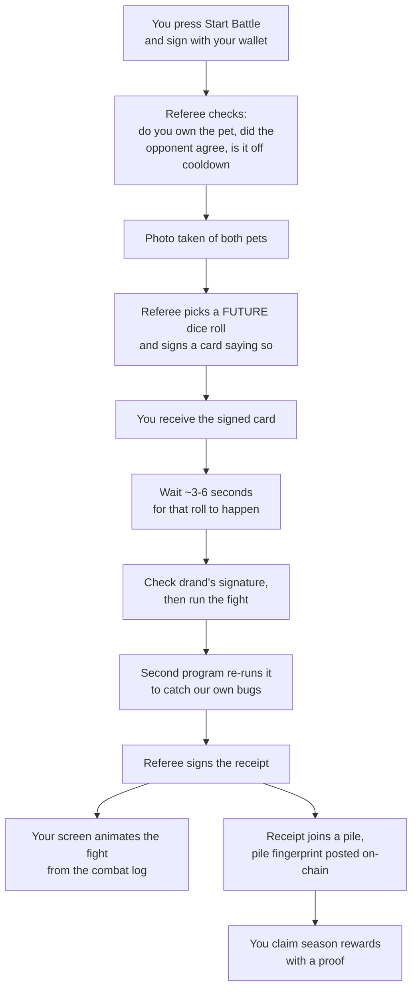

# Backend-authoritative battle architecture

Status: proposed architecture, not an implementation spec.

This document has two halves.

- **Part 1** explains the whole design in plain words, with no jargon. Read it even if you plan to
  read Part 2. It takes about ten minutes.
- **Part 2** is the precise specification: field lists, state machines, hash definitions, phases.
  Every section there starts with a one-line plain-words summary, so you can skim.

| If you want | Go to |
|---|---|
| To understand what we are building and why | Part 1 |
| To decide whether to approve it | Part 1, then §A trust model |
| To build it | Part 2 |
| What to build first | §L implementation order |
| Unfamiliar word | Glossary at the end |

---

# Part 1: the whole idea, in plain words

## 1. What we want

Right now, every pet battle is a blockchain transaction. The blockchain rolls the dice, does the
fight math, and writes down who won.

That works, and it is very trustworthy, but it has three problems:

1. **It costs money.** Every single battle pays gas.
2. **It is slow to change.** The fight math is written four times: once in Solidity, once in Rust,
   once in Go, once in TypeScript. Changing one rule means changing all four and re-testing them
   against each other.
3. **It limits the game.** Team battles, equipment, and new skills all multiply that cost.

So we want to move the fight itself onto our own server. Battles become free and instant, and we
can add new mechanics without upgrading contracts on two blockchains.

## 2. The worry

If our server decides who wins, then our server could cheat.

It could make a favored player win. It could re-roll the dice until it liked the answer. It could
quietly delete a battle that went badly. Nobody outside the company could tell.

That is the entire problem this document solves. Everything below is a trick for making cheating
either impossible or *visible after the fact*.

Think of our backend as a **referee**. We are not asking players to trust the referee. We are
building a system where the referee has to show their work.

## 3. Trick one: take a photo before the fight

Before a battle starts, we write down exactly what both pets look like: level, stats, skills,
equipment. We freeze it. Call it the **photo**.

Why this matters: if we did the math later using live data, a pet could level up mid-fight and
change the answer. Worse, the referee could quietly adjust a stat. With a frozen photo, the fight
is decided entirely by things that were written down in advance.

## 4. Trick two: use dice nobody owns

The referee must not roll the dice, because a referee who rolls the dice can keep rolling until
they get the answer they want. Even a perfectly random roll is suspect if the roller can discard
it and roll again.

So we use somebody else's dice: a public service called **drand**. Picture a giant dice tower in a
public square that drops a new random number every three seconds, in front of everyone, forever.
Nobody owns it. Nobody can stop it or change it. Every roll comes with a signature proving it is
genuine, so you can check it yourself instead of taking our word for it.

Our battle uses one of those rolls.

## 5. Trick three: call the roll before it happens

This is the most important idea in the document, and it is the one the earlier draft got wrong.

Using public dice is not enough on its own. Imagine the referee watches the dice tower, sees the
3:00:06 roll, does the math, dislikes the result, and then says: "actually, this battle was always
going to use the 3:00:12 roll." Redo the math, get a nicer answer. Everything still looks
consistent. The public dice bought us nothing.

The fix: **the referee has to call the roll in advance, out loud, in writing.**

When you press Start Battle, the backend immediately:

1. takes the photo of both pets,
2. picks a roll that has not happened yet (say, two rolls from now),
3. signs a card that says *"battle #4821, these two pets, this photo, will use the 3:00:06 roll"*,
4. **hands you that signed card right away**, before 3:00:06 exists.

Now the referee is locked in. You are holding their signature. If they later claim a different
roll, you can produce the card, and their own signature proves they lied.

The earlier version of this plan only saved the chosen roll in our own database. That proves
nothing, because it is our database and we can edit it. The card has to leave our hands before the
dice land. That is the whole trick.

## 6. Trick four: hand out a receipt anyone can check

When the fight finishes, we give you a **receipt**. It is signed, and it contains everything:

- the photo of both pets,
- which dice roll was used, plus drand's own signature proving that roll is real,
- which version of the rulebook we used,
- what happened, and who won.

Here is the useful part. The fight math is a machine: same photo plus same dice plus same rulebook
always gives exactly the same result. Every time. On any computer.

So anyone can take a receipt, run the fight themselves, and check our answer. Not just us. Not
just partners. Anyone, including a suspicious player. We will publish a small program that does
exactly this.

This is what makes the referee honest in practice. We are not asking anyone to believe us. We are
publishing our homework with the working shown, and anyone can mark it.

## 7. Trick five: glue the receipts together

A dishonest referee could stop lying about results and simply *hide* a battle they did not like.

So receipts are numbered and glued: receipt 500 contains a fingerprint of receipt 499, which
contains a fingerprint of 498, and so on. Like pages sewn into a book instead of loose sheets. Tear
one out and the stitching is visibly broken.

We glue them twice: once in one long chain of every battle, and once per pet, so you can follow a
single pet's whole history without reading everybody else's.

That second chain exists for a specific reason. Once XP lives on our server instead of the
blockchain, you cannot check a pet's level by reading the blockchain. The only way to prove a pet
really was level 12 is to replay the battles that got it there. The per-pet chain is what makes
that possible to do quickly.

## 8. Prizes still go on the blockchain

Ordinary progression, XP and rating and win counts, stays on our server. It is cheap and it changes
constantly.

Real prizes are different, so they go back on-chain. Periodically we take a big pile of receipts
and squash them into one short fingerprint, called a **root**, and post that fingerprint publicly
on the blockchain. Later, a player claims their season rewards by showing a proof that their
receipt was inside that pile.

One transaction covers thousands of battles instead of one transaction per battle. That is the
saving.

## 9. What this still cannot do

Being honest about the limits is part of the design, so here they are.

- **If someone steals our signing key, they can sign lies.** We keep the key in a locked box (a
  hardware key service) that can only stamp battle receipts, and can never move money. That limits
  the damage. It does not eliminate it.
- **We could refuse to publish a battle at all.** The chains make it *visible*, not impossible.
- **The receipt proves what we published, not that we were honest.** Public replay is what catches
  dishonesty, and it only works if people actually run the checker. That is why we ship it early,
  publish the data, and monitor it ourselves.

If battles ever control serious money, this is not enough, and the design should move to
challenge-based or cryptographic proofs. That threshold should be decided deliberately, not drifted
past.

## 10. One battle, start to finish



The one step that can never be reordered is E before F. The signed card has to reach the player
before the dice land. Everything else can be retried, delayed, or recovered.

## 11. The five ideas, in one table

| Idea | Plain version | Stops |
|---|---|---|
| Photo | Freeze both pets before the fight | Editing stats after seeing the outcome |
| Public dice | Use drand, not our own randomness | Re-rolling until we like the answer |
| Signed card | Call the roll before it happens, hand it to the player | Claiming a different roll afterwards |
| Receipt + replay | Publish every input so anyone can redo the fight | Lying about the result |
| Glued receipts | Chain them so gaps show | Quietly deleting a battle |

---

# Part 2: specification

## §A. Trust model

> **In plain words:** we are not trustless. We are checkable. Here is exactly what you must trust
> and what you can verify yourself.

| Property | Who guarantees it | How you check it |
|---|---|---|
| Who owns a pet | The chain | Read the contract |
| Who owns a reward token | The chain | Read the contract |
| Which battles the operator claims happened | Operator signature | Verify against a published key |
| That a battle used the seed it claims | drand, plus the pre-commitment | Verify the beacon signature and your signed commitment |
| That the result is correct for those inputs | Nobody. It is recomputable | Re-run the ruleset and compare |
| That no battle was hidden | Nobody, fully | Hash chains make gaps visible, not impossible |

Three mechanisms carry the weight: commit before reveal (§E), public replay (§H), and receipt hash
chains (§G).

Not prevented, only bounded: a compromised signing key, and refusal to publish. Bounded by key
isolation, reward caps, inclusion monitoring, and emergency pause.

## §B. Why not keep battles fully on-chain

> **In plain words:** correctness is not the problem. Cost and rigidity are.

The current EVM flow in `contracts/ethereum/src/GameLogic.sol`: validate and snapshot both pets,
request Pyth Entropy, wait for the reveal, call `CombatSim.simulate`, write win/loss and XP and
cooldown and opponent history, emit `BattleResolved`. Solana mirrors this with Switchboard and
`settle_battle`.

Costs: gas per battle for randomness, simulation, and state writes; four coordinated ports per rule
change; and features like team battles multiply both.

Moving only the simulation off-chain while still settling each battle on-chain removes the
simulation cost but keeps per-battle gas. This design keeps routine progression off-chain and
settles only aggregated, valuable rewards.

## §C. Authority boundary

> **In plain words:** the chain owns things of value. The backend owns the game loop. Everything
> else is a cache and can be thrown away.

**On-chain authority:** pet and item ownership; NFT transfers and marketplace settlement; reward
custody; authorized batch roots; claims and nullifiers; emergency pause and signer governance.

**Backend authority:** matchmaking and challenge acceptance; backend-mode cooldowns; XP, rating,
win/loss, season progression; request-time snapshots; randomness-round commitment; combat execution
and logs; signed commitments and receipts; reward aggregation and proof generation.

**Non-authoritative projections:** WebSocket updates; cached roster and leaderboard responses;
animation state; Redis caches.

Postgres is the durable workflow ledger, but finalized on-chain ownership is the input authority.
The backend must be able to rebuild every projection from chain data, signed receipts, and batch
records.

## §D. Intent and consent

> **In plain words:** your wallet authorizes the battle, not a login token. And the defender agrees
> in advance so they can be challenged while offline.

### Signed battle intent

A JWT is fine for API access but is the wrong thing to authorize a battle, because it is a bearer
token we issued to ourselves. The wallet signs a canonical, expiring intent:

```text
schemaVersion
chainId
deploymentId
attackerOwner
attackerPetId
defenderOwner
defenderPetId
challengeId
clientNonce
rulesetHash
expiresAt
```

Requirements:

- EIP-712 typed data for EVM wallets; domain-separated sign-message format for Solana.
- Bind to `chainId` **and** `deploymentId`, so a staging signature cannot be replayed on production.
- Reject expired intents and consumed nonces.
- Require attacker ownership at the finalized source version.
- Never let a JWT user submit a battle for another wallet.

### Standing defender consent

The current EVM contract lets anyone attack anyone's pet. Backend ranked mode should not apply
cooldown or rating changes to an unwilling defender. But requiring a live signature from the
defender would mean you can only fight players who are online, which is a large product regression.

Resolution: a long-lived `DefenseAuthorization`, signed once.

```text
schemaVersion
chainId
deploymentId
defenderOwner
petIds              (or "all pets I own")
rulesetHash         (consent is to a specific ruleset version)
minLevel
maxLevel
maxBattlesPerDay
notBefore
expiresAt
revocationNonce
```

Rules:

- Consent is per ruleset version, so a rules change invalidates outstanding authorizations. This
  prevents "I agreed to the old combat rules" disputes.
- Revocation is immediate, recorded in the ledger, with its timestamp in any affected receipt.
- Every receipt embeds the hash of the authorization it relied on.
- Live PvP is the same object with a short `expiresAt`.

This is a real design decision. Without it, backend ranked mode is online-only.

## §E. Randomness: commit before reveal

> **In plain words:** trick three from Part 1. Sign the chosen dice roll and give it to the player
> before that roll exists.

### Mechanism

1. On acceptance, mechanically choose a future round: current verified round plus a fixed offset.
   The offset is a constant, never a per-battle choice.
2. Persist the round, then **sign a `BattleCommitment` with the KMS key and return it in the accept
   response** to both players.
3. Wait for the round to publish.
4. Verify the drand BLS signature and chain hash.
5. Store the complete beacon proof in the receipt.
6. Derive the seed with domain separation:

```text
battleSeed = keccak256(canonical(
  "CRYPTOPETS_BATTLE_V1",
  chainId, deploymentId,
  drandRandomness,
  battleId,
  snapshotHash,
  rulesetHash
))
```

`canonical(...)` is the encoder in `protocol/src/encoding/writer.ts`: fixed-width integers, and a
4-byte length prefix on every variable-length element. Field order is as listed. This is not bare
`||` concatenation, and the difference matters: concatenated without prefixes, deployment `ab` with
battle id `c` produces the same preimage as `a` with `bc`, so a boundary an attacker can move is a
seed they can reach twice. `contracts/test-vectors/protocol-seed.json` carries that exact pair as a
case.

The tag is the version. A future derivation gets a new tag, which leaves every historical seed
derivable under the old one, so there is no schema-version field here.

Never derive randomness from timestamps, UUIDs, backend secrets, or a round chosen after its value
was known.

### Why the database row is not a commitment

Persisting the chosen round in Postgres proves nothing to anyone outside the operator, because the
database is the operator's. After seeing round R produce an unwanted result, the operator can claim
it committed to R+2, recompute, and every downstream artifact will be perfectly self-consistent and
wrong.

Merkle batching does not fix this, because batches anchor *after* computation. An anchor that
happens later is not a commitment.

The commitment must therefore leave the operator's control before the round publishes:

```text
BattleCommitment
  commitmentSchemaVersion
  battleId
  intentHash
  defenseAuthorizationHash
  snapshotHash
  attackerSnapshot
  defenderSnapshot
  rulesetVersion
  rulesetHash
  drandChainHash
  drandRound                <- future round, value not yet known
  acceptedAt
  previousCommitmentHash
  signingKeyId
```

Signed by the same KMS key family as receipts, returned synchronously in the accept response, and
served from a public endpoint. A dishonest reroll then requires a second signature over the same
`battleId`, which is self-incriminating if either player kept their copy.

Commitments carry their own hash chain, so the sequence of accepted battles is tamper-evident
independently of receipts.

### Latency budget

This architecture exists to serve a real-time battle UX, so the offset is a hard floor on
time-to-first-animation.

| drand chain | Round period | Offset of 2 rounds | Notes |
|---|---|---|---|
| Mainnet default | 30s | up to 60s | Too slow for interactive battles |
| Quicknet | 3s | up to ~6s | Viable; unchained, BLS signatures on G1 |

Recommendation: quicknet, offset 2 rounds, roughly 3 to 6 seconds from Start Battle to the first
animated strike. Comparable to the current on-chain entropy wait, so not a UX regression. Verify
current drand parameters and public keys before committing; treat these numbers as a starting
point.

The client must verify the BLS signature itself against a pinned public key. If it accepts our word
for the beacon value, commit-before-reveal buys nothing client-side. This needs a BLS12-381 verifier
in the browser bundle (for example `@noble/curves`). Confirm the bundle-size cost before locking in
drand.

### Failure and cancellation

- If the committed round cannot be fetched, **retry the same round indefinitely**. Never substitute
  a round whose value is known.
- On a permanent beacon outage past the defined timeout, the battle ends `forfeited` with no
  progression change, and both pets stay locked for a cooldown spanning several rounds. This stops
  players manufacturing outages to escape bad battles.
- **No player-initiated cancellation after `committed`.** This is a grinding defense. If abandoning
  a seeded battle were free, a player could submit many battles and keep only the good ones.
- Disconnection, tab close, and app kill are irrelevant to resolution. The client is a viewer of a
  result that will be recorded regardless.

## §F. Versioned deterministic combat

> **In plain words:** the fight math becomes a versioned, published rulebook, and we run a second
> copy to catch our own bugs.

`protocol/src/combat/` (moved out of `shared/src/utils/combat/`, which now re-exports it) becomes the
canonical computation path for backend and client replay.
Every battle records `rulesetVersion`, `rulesetHash`, the immutable skill/balance configuration,
the snapshot hash, the beacon proof, the derived seed, and the result plus combat-log hash.

### Workstream: port XP and progression to TypeScript

This is real work on the critical path, not a checklist item.

`protocol/src/combat/` today implements fight math only. There is no `xp.ts`. XP lives solely in
`indexer-go/internal/combat/xp.go`, and it depends on stateful inputs the current client cannot see:
`lastOpponentId` and same-opponent streak decay (`xp.go:32-41`). That is exactly why the TS port
stopped at fight math.

Under backend authority that state moves into `PetBattleProgress`, so it becomes portable:

1. Port `xp.go` to `protocol/src/combat/xp.ts`, reading streak state from the frozen snapshot
   rather than chain state.
2. Extend the snapshot to carry `lastOpponentId` and `streak` per pet, so progression is a pure
   function of the receipt's own inputs and stays independently replayable.
3. Add golden vectors for progression under the new snapshot shape, alongside
   `contracts/test-vectors/xp.json`.

Until this lands, the verifier cannot compare progression deltas and receipts cannot carry a
meaningful `progressionDelta`.

### What the Go verifier is for

Before signing, `indexer-go/internal/combat/` independently recomputes the result. TypeScript and Go
must match exactly on winner, round count, winner HP remaining, XP/progression delta, and
combat-log hash. Any mismatch stops receipt signing for that ruleset, alerts operators, retains both
outputs and all inputs, and never silently prefers one implementation.

**Be clear about what this buys.** Both ports descend from `CombatSim.sol`, are held in lockstep by
the same golden vectors, built by the same pipeline, and run by the same operator. The Go verifier
catches implementation drift, bad deploys, and transcription bugs. It does **not** constrain a
dishonest operator, who controls both processes. Its role is release safety.

The mechanism that constrains a dishonest operator is public replay (§H).

### Golden vectors

Keep the existing vectors in `contracts/test-vectors/`. Add vectors for intent hashing,
defense-authorization hashing, snapshot hashing, drand seed derivation, commitment hashing, receipt
hashing, progression calculation, and team-battle aggregation.

During migration, freeze Solidity and Rust combat as the legacy on-chain ruleset. New backend-only
mechanics require parity between the canonical TypeScript engine, the Go verifier, and client
replay. The existing four-port rule stays in force until the legacy path retires (§K).

## §G. Signed battle receipt

> **In plain words:** the permanent record. It holds every input, so anyone can redo the fight, and
> it links to the previous one so nothing can be quietly removed.

```text
receiptSchemaVersion
battleId
chainId
deploymentId
intentHash
commitmentHash
defenseAuthorizationHash
attackerSnapshot
defenderSnapshot
snapshotHash
sourceChainVersions
drandChainHash
drandRound
drandSignature
drandRandomness
rulesetVersion
rulesetHash
result
combatLogHash
progressionDelta
rewardDelta
sequence
previousReceiptHash                  <- global chain, per signing key
attackerProgressPrevReceiptHash      <- per-pet chain
defenderProgressPrevReceiptHash      <- per-pet chain
createdAt
signingKeyId
```

### Why three hash links

`sequence` alone is an ordering the operator asserts. The links make history tamper-evident.

- `previousReceiptHash` links every receipt under a signing key into one chain. Reordering or
  removal breaks it, and equivocation (two receipts claiming the same predecessor) becomes provable
  with two signatures.
- The per-pet links solve a subtler problem. Because XP and rating are off-chain (§C), a pet's
  snapshot is **not** verifiable against the chain. Confirming a pet really was level 12 requires
  replaying that pet's prior backend battles. Without a per-pet link that means scanning the whole
  ledger; with it, a verifier walks one pet's history directly.

This is what makes off-chain progression auditable rather than asserted, and it is what allows §H to
work at all.

### Encoding and signing

Encoding must be canonical. JSON property ordering is not sufficient unless canonical JSON is
explicitly implemented and tested. Prefer a fixed binary encoding or an EIP-712-compatible typed
hash.

Sign only the digest:

- Private key in a managed KMS/HSM, out of the API and worker environments.
- No asset custody, no withdrawal authority.
- Separate keys for EVM and Solana reward domains.
- Publish public keys and validity periods; retain rotated-out keys.
- Log every KMS request, digest, result, and key version.
- Signer accepts only the exact commitment and receipt schemas. Never expose a generic
  state-mutation signing endpoint.
- Signer requires matching attestations from the TypeScript engine and the Go verifier.

## §H. Public replay

> **In plain words:** trick four. This is the thing that actually keeps us honest, so it is a
> deliverable, not a bullet point.

Because the receipt carries every input, any third party can recompute the fight and compare. Ship:

1. **A standalone verifier binary.** Minimal dependencies, no backend access, no database. Input: a
   receipt or a range of receipts. Output: pass/fail per check, covering signature validity, drand
   BLS signature, seed derivation, combat replay, progression, hash-chain continuity, and Merkle
   inclusion.
2. **Pinned ruleset artifacts.** Each `rulesetVersion` published as an immutable, content-addressed
   bundle so historical battles reproduce exactly.
3. **A public receipt corpus.** Paginated export by pet, by wallet, and by sequence range, so replay
   needs no special access.
4. **Published signing keys** with validity periods, including rotated-out keys.

Licensing note: outsiders are expected to run this, so it cannot live under `backend/` (PolyForm
Noncommercial). See §K.

## §I. Merkle batches and reward claims

> **In plain words:** trick five. Squash thousands of receipts into one fingerprint, post that
> on-chain, and let players claim rewards with a proof.

Normal battles send no transactions. A batcher periodically aggregates signed receipts. Each
per-chain batch commits:

```text
batchNumber
previousRoot
merkleRoot
rulesetSetHash
firstSequence
lastSequence
createdAt
```

A minimal root-registry contract/program stores accepted roots. A separate claim path verifies
Merkle proofs for aggregate season rewards.

Claims must bind: chain and root registry; season/batch; wallet beneficiary; reward asset and
amount; unique claim/nullifier ID; Merkle root.

Security limits: cap reward value per battle, wallet, batch, and season; enforce one-time claims;
support emergency pause; rotate root publishers through multisig and timelock; alert when signed
receipts are omitted beyond the inclusion SLO; publish receipt-to-root inclusion proofs.

Merkle anchoring makes publication immutable. It does not prove honest computation (that is §H) and
it does not force inclusion. An unanchored signed receipt is evidence of operator failure, not an
on-chain claim. If omission risk becomes unacceptable, add a delayed direct-receipt claim fallback
or an optimistic challenge protocol.

Implement the EVM registry and claim path first. Port to Solana only after operating the EVM version
successfully.

## §J. Ledger, delivery, and recovery

> **In plain words:** the database is the source of truth for battles in flight; the WebSocket is
> just a notification and must stop broadcasting everything to everyone.

### Durable state machine

Add explicit Prisma models rather than treating `BattleHistory` as the workflow: `BattleIntent`,
`DefenseAuthorization`, `BattleLedger`, `BattleCommitment`, `BattleReceipt`, `BattleBatch`,
`BattleRuleset`, `PetBattleProgress`, `BattleOutbox`.

```text
accepted
  -> committed          (round chosen, commitment signed and delivered)
  -> seeded             (round published, signature verified, seed derived)
  -> computed
  -> verified
  -> signed
  -> published
  -> batched
```

Failure transitions:

```text
rejected              (validation failed, before any commitment)
expired               (intent expired before acceptance)
verification_failed   (engine/verifier mismatch, circuit breaker trips)
signing_failed
forfeited             (see §E)
```

`rejected` exists only before `committed`. Once committed, a battle resolves.

Requirements:

- Wallet-provided idempotency nonce with a unique database constraint.
- Lock both pets in deterministic ID order inside a serializable transaction.
- Validate ownership, readiness, level band, consent, and snapshot source version.
- Persist the complete immutable snapshot **before** randomness exists.
- Commit each state transition and its outbox message atomically.
- Process jobs at least once; every transition idempotent.
- A duplicate battle ID with a different payload is a security alert, never an upsert.
- Append-only audit events for every transition.

### The WebSocket

`backend/src/ws/liveBattleSocket.ts` currently broadcasts every message to every connected client,
deliberately, because clients filter by `(chainId, requestId)` themselves and the payload was
chain-derived data anyone could read anyway.

That stops being acceptable here, because the payload now carries the full combat log. A global
broadcast would tell every connected client the outcome of every battle as it resolves.
`BattleRoom` already exists in Prisma and `battle-room.service.ts` already mints room IDs, so scope
subscriptions to the room.

Two changes: **notification-only** (never authoritative, always re-fetchable) and **per-room**
(never global).

### Required APIs

Create/accept battle intent (returns the signed commitment); get battle state by ID; get signed
commitment; get signed receipt; get combat log; get batch and Merkle proof; get active signing keys
and rulesets; verify-receipt endpoint alongside the standalone verifier.

### Frontend behavior

1. Submit the signed intent.
2. Store the battle ID **and the signed commitment** locally. The commitment is the player's own
   evidence, so it must survive a reload.
3. Subscribe to the room's WebSocket for responsiveness.
4. Poll or refetch the authoritative endpoint after reconnect.
5. Verify the receipt signature, the drand BLS signature, and the hash links.
6. Replay the combat log and animate.
7. Show batch inclusion and reward-claim status as separate, later states.

### Operations

Postgres point-in-time recovery with tested restores; dead-letter queue for exhausted jobs; multiple
stateless compute workers; independently deployed verifier; protected signer with minimal network
access; structured logs and metrics; reconciliation between finalized chain ownership, snapshots,
receipts, and claims.

Alert on: engine/verifier mismatch; repeated nonce; unsigned or unbatched backlog; drand fetch
delay; commitment delivery failure (accept succeeded but the player never received a signed
commitment); root-anchor delay; receipt omission; hash-chain discontinuity; unusual win
distribution; reward-cap violation; signer use outside expected throughput.

### Threats and controls

Threats: compromised API or database; compromised signing key; dishonest operator; randomness reroll
after seeing the value; outcome grinding by repeated submit-and-abandon; intent replay;
cross-chain or cross-deployment replay; duplicate workers; stale ownership after NFT transfer;
concurrent battles with the same pet; forged equipment snapshots; forged defender consent;
denial-of-service against popular opponents; fraudulent or omitted reward batches.

Controls: domain-separated intents, commitments, and receipts bound to `chainId` + `deploymentId`;
nonce uniqueness and expiry; signed pre-commitment delivered before reveal (§E); no cancellation
after `committed` (§E); finalized ownership checks; deterministic row locking; immutable snapshots;
standing consent with revocation, hashed into the receipt (§D); per-wallet and per-pet rate limits;
daily battle and reward limits; separate compute, verify, and sign roles; circuit breaker on any
mismatch; public replay tooling (§H); capped on-chain economic exposure; emergency pause for roots
and claims.

## §K. Repository changes this requires

> **In plain words:** two existing rules in this repo conflict with this plan, and one of them is a
> licensing problem that has to be settled before code is written.

### Rules and docs

The four-port combat rule is a `MUST` in `AGENTS.md`, restated in `CLAUDE.md`. It is not merely
roadmap guidance, so accepting this document does not relax it. Amend both files **at Phase 6**,
when the legacy on-chain path actually retires, not at acceptance.

Update `docs/plan-future-features-roadmap.md` on acceptance:

- Replace team battles that repeatedly call on-chain `CombatSim` with backend orchestration over a
  versioned ruleset.
- Remove the claim that team battles are inherently low risk. Authorization, snapshots, seed
  commitment, signer scope, and reward aggregation are all security-sensitive.
- Change equipment guidance: backend combat needs no Solidity/Rust implementation per new rule, but
  equipment ownership and accepted-battle snapshots must stay verifiable.
- Treat the settle keeper as legacy for battle execution.
- Correct stale dual-indexer descriptions if `indexer-go` remains the only active writer.
- Keep stories and AI narrative content out of combat inputs.

### Licensing placement

`contracts/ethereum`, `contracts/solana`, `indexer-go`, and `proto` are MIT; everything else is
PolyForm Noncommercial.

- Root registry and claim contracts land in `contracts/ethereum`, so MIT, no action needed.
- **The standalone public verifier (§H) cannot live under `backend/`.** A verifier outsiders are
  expected to run must be licensed so they can run it. Decide its home before writing it: an MIT
  top-level package such as `verifier/`, or extend the MIT Go combat package in `indexer-go`.

## §L. Migration and implementation order

> **In plain words:** do not turn off the on-chain path first. Build the checkable parts before
> anything of value is at stake.

### Phases

**Phase 1, specification.** Freeze canonical encodings (intent, consent, snapshot, seed, commitment,
result, receipt, Merkle leaf). Write the threat model and key-compromise runbook. Decide which
progression is off-chain and which rewards are claimable. Decide consent and matchmaking rules.
Confirm drand chain, offset, and browser BLS cost.

**Phase 2, XP port and shadow computation.** Port XP/progression to TypeScript (§F) with golden
vectors. Keep normal on-chain battles running. Compute every settled battle through the backend
engine, verify with Go, compare against `BattleResolved`. Require zero deterministic mismatch over a
defined observation window.

**Phase 3, rewardless backend battles.** Separate backend battle mode alongside the on-chain one.
Off-chain XP/rating/cooldown stored distinctly from NFT state. Signed commitments and receipts with
no transferable reward. **Ship the standalone verifier and receipt corpus in this phase**, not
later: public replay needs exercising while nothing of value is at stake. Drill recovery, replay,
key rotation, and incident response.

**Phase 3.5, optional: per-battle on-chain settlement.** If per-battle XP must stay NFT state, stop
here. A backend-signed result verified by the contract keeps chain state authoritative and removes
only the simulation cost. It still pays per-battle gas, so it does not reach this document's goal,
but it is strictly safer and is a legitimate end state, not merely a stepping stone.

**Phase 4, anchored batches.** Deploy the EVM root registry and capped claim contract. Anchor
low-value test batches. Publish proofs and independent verification tooling. Monitor omissions,
mismatch rates, operational lag.

**Phase 5, bounded rewards.** Conservative aggregate season rewards with per-wallet, per-batch, and
global caps. Solana only after the EVM receipt and operations model is stable.

**Phase 6, deprecate per-battle settlement.** Only after stable operations and an external security
review. Keep legacy receipts and events replayable. Never represent off-chain XP as NFT state unless
a successful aggregate claim applied it on-chain.

### Build order

1. Threat model and canonical schemas.
2. Transactional ledger and signed-intent API.
3. Standing defender consent.
4. drand commitment, signed `BattleCommitment` delivery, beacon verification.
5. XP/progression port to TypeScript with golden vectors.
6. Canonical TypeScript execution and independent Go verification.
7. Isolated KMS signing for commitments and receipts.
8. Receipt hash chains and public receipt corpus.
9. Standalone verifier binary and pinned ruleset artifacts.
10. WebSocket scoped per room and made non-authoritative.
11. Shadow current on-chain battles.
12. Launch rewardless backend battles.
13. EVM Merkle root registry and capped aggregate claims.
14. Security review and operational drills.
15. Enable bounded rewards.
16. Port the proven root/claim interface to Solana.

## §M. Approaches intentionally deferred

> **In plain words:** four other ways to solve this, and why each is wrong for now.

**Fully centralized, unsigned backend.** Easy to build; weak auditability, poor key separation, no
durable player proof. Non-economic prototypes only.

**Per-battle backend signature settled on-chain.** Chain state stays authoritative and the contract
verifies every outcome, but every battle still costs gas. See Phase 3.5.

**Optimistic settlement.** Reduces trust with bonded proposals and challenge windows, at the cost of
watcher liveness, griefing vectors, and more complex contracts. Reconsider when battle value
justifies it.

**Zero-knowledge proof.** Strong correctness, but requires circuit authoring, proving
infrastructure, and careful version upgrades. Disproportionate for the current product stage.

**State channels, rollup, or appchain.** Adds sequencer, bridge, data-availability, and operational
risk well beyond the battle problem. Not worth introducing solely to reduce combat gas.

---

## Glossary

| Term | Meaning here |
|---|---|
| **Intent** | A wallet-signed, expiring request to fight. Permission, not a result. |
| **Standing consent** | A defender's long-lived signed permission to be challenged, so battles work while they are offline. |
| **Snapshot** | The "photo": both pets' stats frozen at acceptance, before randomness exists. |
| **drand** | A public randomness service that publishes a signed random number on a fixed schedule. Nobody here controls it. |
| **Beacon round** | One tick of drand, identified by number. Round 12345 has exactly one value, forever. |
| **Commitment** | Our signed statement of which future round a battle will use, handed to players before that round exists. |
| **Seed** | The number derived from the beacon value that drives the fight's randomness. |
| **Ruleset** | A versioned, content-addressed bundle of combat rules and balance config. Battles record which one they used. |
| **Receipt** | The signed permanent record of one battle, containing every input needed to recompute it. |
| **Hash chain** | Each receipt referencing its predecessor, so deletion or reordering is detectable. |
| **Public replay** | Anyone re-running a battle from its receipt and checking our answer. |
| **KMS / HSM** | The locked box holding the signing key. It can stamp receipts and nothing else. |
| **Merkle root** | One short fingerprint standing for a whole pile of receipts, posted on-chain. |
| **Merkle proof** | The short evidence that your receipt was in that pile. |
| **Nullifier** | A one-time marker preventing a reward from being claimed twice. |
| **Equivocation** | Signing two conflicting statements about the same battle. Provable cheating. |
