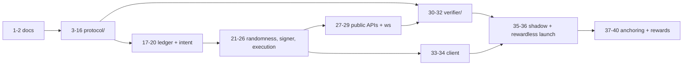

# Backend-authoritative battle: implementation steps

Companion to [plan-backend-battle-architecture.md](./plan-backend-battle-architecture.md). That
document says what to build and why. This one splits it into commit-sized steps.

Section references (§A, §E, §L) point at the architecture document.

## How this runs

- **One step, one commit.** Every step below is scoped so it can land on its own without breaking
  the repo. If a step turns out to need two commits, split it and keep the numbering.
- **Every step has a verification command.** "Done" means that command passes, not that the code
  looks right.
- **Branch per step group** (`feat/protocol-package`, `feat/battle-ledger`, ...), not per step.
- Steps 1 to 14 have no dependency on backend or chain work, so they can proceed while the
  Phase 1 decisions in §L are still being settled.

## Settled decisions

Recorded here so later steps stop re-litigating them.

| Decision | Choice | Where it came from |
|---|---|---|
| Canonical protocol code home | New MIT top-level `protocol/` package | §K licensing constraint |
| Public verifier home | New MIT top-level `verifier/` package (TypeScript CLI) | §H, §K |
| TS combat engine | Moves from `shared/src/utils/combat/` into `protocol/`, re-exported from `shared` | Verifier must replay combat and must be MIT |
| Randomness beacon | drand quicknet, 3s rounds, fixed offset of 2 rounds | §E latency budget |
| First reward chain | EVM only; Solana after EVM operations are stable | §I, §L Phase 5 |

Open, and deliberately not blocking steps 1 to 14: exact reward economics (§I caps), whether
Phase 3.5 becomes the end state, and the KMS provider.

---

## Group A: specification and licensing (§L Phase 1)

### Step 1: threat model and key-compromise runbook
- Scope: write the threat model as its own document (the §J threat list expanded into attacker,
  capability, control, detection, residual risk), plus the runbook for a suspected signing-key
  compromise (pause roots, rotate key, republish key registry, re-verify affected receipts).
- Files: `docs/threat-model-backend-battles.md`, `docs/runbook-signing-key-compromise.md`.
- Verify: no command. Review only.
- Commit: `docs: add backend battle threat model and key-compromise runbook`

### Step 2: reconcile the roadmap with backend combat
- Scope: the §K "update on acceptance" list. Team battles become backend orchestration over a
  versioned ruleset, drop the "inherently low risk" claim, restate equipment guidance, mark the
  settle keeper legacy for battle execution, correct stale dual-indexer text.
- Files: `docs/plan-future-features-roadmap.md`.
- Verify: no command. Review only.
- Commit: `docs: align future-features roadmap with backend-authoritative battles`

---

## Group B: the `protocol/` package (§F, §G, build order 1 and 5)

### Step 3: scaffold the MIT protocol package
- Scope: `@cryptopets/protocol` workspace package, MIT `LICENSE`, README stating the package is
  intentionally MIT because outsiders run the verifier against it. tsconfig, vitest, eslint config
  mirroring `shared`. Consumed as raw TypeScript, same as `shared` (no build step).
- Files: `protocol/{package.json,tsconfig.json,vitest.config.ts,eslint.config.js,LICENSE,README.md}`,
  `protocol/src/index.ts`, `pnpm-workspace.yaml`, root `package.json` lint/test aggregates.
- Verify: `pnpm --filter @cryptopets/protocol test && pnpm --filter @cryptopets/protocol lint`
- Commit: `chore(protocol): scaffold MIT protocol package`

### Step 4: move the combat engine into `protocol/`
- Scope: move `shared/src/utils/combat/*` to `protocol/src/combat/`, and its golden-vector test to
  `protocol/tests/combat/`. `shared/src/utils/combat/index.ts` becomes a re-export so no frontend,
  mobile, or backend import changes. Relicensing note in the package README.
- Files: `protocol/src/combat/*`, `protocol/tests/combat/goldenVectors.test.ts`,
  `shared/src/utils/combat/index.ts`, `shared/package.json` (dependency on `@cryptopets/protocol`).
- Verify: `pnpm --filter @cryptopets/protocol test && pnpm --filter @shared/core test && pnpm --filter frontend build`
- Commit: `refactor(protocol): move TS combat engine out of shared into MIT protocol package`

### Step 5: canonical encoding primitives
- Scope: the fixed binary encoder every hash in this design depends on. Length-prefixed fields,
  explicit integer widths, no JSON. Domain-tag helper, keccak-256 wrapper (legacy Keccak, matching
  the existing simulator hashing), hex and bigint rules. This is the step everything downstream
  inherits its determinism from, so it gets its own tests.
- Files: `protocol/src/encoding/{writer.ts,hash.ts,domain.ts,index.ts}`,
  `protocol/tests/encoding/*.test.ts`.
- Verify: `pnpm --filter @cryptopets/protocol test`
- Commit: `feat(protocol): add canonical binary encoding and keccak hashing primitives`

### Step 6: deployment and schema-version binding
- Scope: `chainId` plus `deploymentId` binding used by every signed object (§D), and the schema
  version registry so a version bump is a code change, not a magic number at a call site.
- Files: `protocol/src/domain/{deployment.ts,schemaVersions.ts}`, tests.
- Verify: `pnpm --filter @cryptopets/protocol test`
- Commit: `feat(protocol): bind signed objects to chainId and deploymentId`

### Step 7: battle intent
- Scope: `BattleIntent` type, canonical hash, EIP-712 typed data for EVM wallets, domain-separated
  sign-message format for Solana. Expiry and nonce fields, no verification logic yet (that is
  backend, Step 18).
- Files: `protocol/src/intent/*`, `contracts/test-vectors/protocol-intent.json`,
  `protocol/tests/intent/*.test.ts`.
- Verify: `pnpm --filter @cryptopets/protocol test`
- Commit: `feat(protocol): add wallet-signed battle intent schema and hashing`

### Step 8: standing defence authorization
- Scope: `DefenseAuthorization` type (§D), canonical hash, EIP-712 and Solana formats,
  `revocationNonce` semantics. Consent is bound to `rulesetHash`.
- Files: `protocol/src/consent/*`, `contracts/test-vectors/protocol-consent.json`, tests.
- Verify: `pnpm --filter @cryptopets/protocol test`
- Commit: `feat(protocol): add standing defense-authorization schema and hashing`

### Step 9: pet snapshot
- Scope: the "photo" (§C, §F). Frozen pet fields plus `lastOpponentId` and `streak`, so progression
  is a pure function of the receipt's own inputs. `snapshotHash` over both pets. Equipment slots
  present but empty until equipment ships.
- Files: `protocol/src/snapshot/*`, `contracts/test-vectors/protocol-snapshot.json`, tests.
- Verify: `pnpm --filter @cryptopets/protocol test`
- Commit: `feat(protocol): add frozen pet snapshot schema and snapshot hashing`

### Step 10: seed derivation
- Scope: the §E derivation exactly as specified, domain-separated over chainId, deploymentId, drand
  randomness, battleId, snapshotHash, rulesetHash. Golden vectors, including one recorded real
  quicknet beacon value.
- Files: `protocol/src/randomness/seed.ts`, `contracts/test-vectors/protocol-seed.json`, tests.
- Verify: `pnpm --filter @cryptopets/protocol test`
- Commit: `feat(protocol): derive battle seed from drand randomness with domain separation`

### Step 11: drand beacon verification
- Scope: pinned quicknet chain hash and public key, BLS12-381 signature verification over
  `@noble/curves`, round-to-time and time-to-round helpers, the fixed offset constant. Pure
  verification, no network client (that is Step 20). Record the bundle-size cost in the README, as
  §E requires.
- Files: `protocol/src/randomness/{drand.ts,beacon.ts}`, fixtures of real quicknet rounds, tests.
- Verify: `pnpm --filter @cryptopets/protocol test`
- Commit: `feat(protocol): verify drand quicknet BLS beacon signatures against a pinned key`

### Step 12: battle commitment
- Scope: `BattleCommitment` type (§E), canonical hash, `previousCommitmentHash` chain link, and a
  chain-continuity checker. No signing here.
- Files: `protocol/src/commitment/*`, `contracts/test-vectors/protocol-commitment.json`, tests.
- Verify: `pnpm --filter @cryptopets/protocol test`
- Commit: `feat(protocol): add battle commitment schema, hashing, and chain link`

### Step 13: XP and progression port
- Scope: build order step 5, and the §F workstream. Port `indexer-go/internal/combat/xp.go` to
  `protocol/src/combat/xp.ts`, reading streak state from the snapshot rather than chain state.
  Produce a `progressionDelta` (xp, level, streak, rating inputs) as a pure function.
- Files: `protocol/src/combat/xp.ts`, `contracts/test-vectors/protocol-progression.json`,
  `protocol/tests/combat/xp.test.ts` (runs the existing `contracts/test-vectors/xp.json` too).
- Verify: `pnpm --filter @cryptopets/protocol test` and `cd indexer-go && go test ./internal/combat`
- Commit: `feat(protocol): port XP and progression math to TypeScript with golden vectors`

### Step 14: ruleset versioning
- Scope: `rulesetVersion` and `rulesetHash` over the combat config and skill/balance configuration,
  plus the content-addressed ruleset bundle format §H requires for historical replay.
- Files: `protocol/src/ruleset/*`, `contracts/test-vectors/protocol-ruleset.json`, tests.
- Verify: `pnpm --filter @cryptopets/protocol test`
- Commit: `feat(protocol): add content-addressed ruleset versioning and hashing`

### Step 15: battle receipt
- Scope: `BattleReceipt` type (§G) with all three hash links, canonical hash, combat-log hash, and
  the chain-continuity checkers for the global chain and both per-pet chains.
- Files: `protocol/src/receipt/*`, `contracts/test-vectors/protocol-receipt.json`, tests.
- Verify: `pnpm --filter @cryptopets/protocol test`
- Commit: `feat(protocol): add signed battle receipt schema, hashing, and hash chains`

### Step 16: Merkle leaves and proofs
- Scope: canonical Merkle leaf encoding for a receipt, tree construction, proof generation and
  verification, matching whatever the EVM registry will accept (Step 33). Vectors so Solidity and
  TypeScript cannot drift.
- Files: `protocol/src/merkle/*`, `contracts/test-vectors/protocol-merkle.json`, tests.
- Verify: `pnpm --filter @cryptopets/protocol test`
- Commit: `feat(protocol): add canonical Merkle leaf encoding, proofs, and vectors`

---

## Group C: backend ledger and intent (§J, build order 2 and 3)

### Step 17: Prisma models and migration
- Scope: the §J models. `BattleIntent`, `DefenseAuthorization`, `BattleLedger`, `BattleCommitment`,
  `BattleReceipt`, `BattleBatch`, `BattleRuleset`, `PetBattleProgress`, `BattleOutbox`. Unique
  constraint on the wallet idempotency nonce. `BattleHistory` is untouched, since the on-chain path
  keeps running.
- Files: `backend/prisma/schema.prisma`, `backend/prisma/migrations/*`.
- Verify: `pnpm --filter backend build` and a migration applied against a scratch database.
- Commit: `feat(backend): add battle ledger, commitment, receipt, and progress models`

### Step 18: ledger state machine
- Scope: the §J transition table as code, with every transition idempotent and each one writing its
  outbox message in the same transaction. Deterministic pet lock ordering. No HTTP surface yet.
- Files: `backend/src/features/battle-ledger/{state.ts,transitions.ts,outbox.ts,index.ts}`, tests.
- Verify: `pnpm --filter backend test`
- Commit: `feat(backend): add transactional battle ledger state machine and outbox`

### Step 19: signed intent submission
- Scope: verify an EIP-712 or Solana-signed `BattleIntent`, check finalized attacker ownership,
  consume the nonce, reject expiry and cross-deployment replay, create the ledger row in `accepted`.
  A JWT can carry the request but never authorizes another wallet's battle.
- Files: `backend/src/features/battle-ledger/intent.service.ts`, `backend/src/routes/battle.ts`,
  tests.
- Verify: `pnpm --filter backend test`
- Commit: `feat(backend): accept wallet-signed battle intents`

### Step 20: standing defender consent
- Scope: store, verify, and revoke `DefenseAuthorization`. Level band, daily battle cap, immediate
  revocation with its timestamp available to receipts.
- Files: `backend/src/features/battle-ledger/consent.service.ts`, routes, tests.
- Verify: `pnpm --filter backend test`
- Commit: `feat(backend): add standing defender consent with immediate revocation`

---

## Group D: randomness, signing, execution (build order 4, 6, 7)

### Step 21: drand client
- Scope: fetch quicknet rounds, verify with the `protocol/` verifier, cache verified rounds, retry
  the same committed round indefinitely (§E), never substitute a known round. Metrics for fetch
  delay.
- Files: `backend/src/features/battle-randomness/*`, tests with a stubbed HTTP transport.
- Verify: `pnpm --filter backend test`
- Commit: `feat(backend): add verified drand quicknet round client with same-round retry`

### Step 22: isolated signer
- Scope: signer interface accepting only the exact commitment and receipt schemas, digest-only
  signing, KMS adapter plus a local dev adapter, key registry with validity periods including
  rotated-out keys. No generic signing endpoint, ever.
- Files: `backend/src/features/battle-signer/*`, tests.
- Verify: `pnpm --filter backend test`
- Commit: `feat(backend): add schema-restricted KMS signer for commitments and receipts`

### Step 23: accept flow, snapshot and commitment delivery
- Scope: the one ordering that can never be relaxed. On acceptance: snapshot both pets, pick
  `currentRound + 2`, persist, sign the `BattleCommitment`, and return it synchronously in the accept
  response. Alert when accept succeeds but commitment delivery fails.
- Files: `backend/src/features/battle-ledger/accept.service.ts`, integration test asserting the
  commitment is signed and returned before the committed round exists.
- Verify: `pnpm --filter backend test`
- Commit: `feat(backend): sign and deliver battle commitment before the drand round publishes`

### Step 24: seeded and computed worker
- Scope: worker driving `committed` to `seeded` to `computed`. Verify the beacon, derive the seed,
  run `protocol/` combat plus progression, persist the combat log and its hash.
- Files: `backend/src/features/battle-worker/*`, tests.
- Verify: `pnpm --filter backend test`
- Commit: `feat(backend): compute battles from verified drand seeds in a worker`

### Step 25: independent Go verification
- Scope: §F release safety. `indexer-go` gains a snapshot-shaped verify entry point over its
  existing combat and xp packages, exposed to the backend. Mismatch on winner, rounds, winner HP,
  progression delta, or combat-log hash stops signing for that ruleset, alerts, and retains both
  outputs. Never silently prefer one implementation.
- Files: `indexer-go/internal/combat/verify.go`, `indexer-go/internal/grpcsrv/*` (or an HTTP
  endpoint), `proto/cryptopets.proto` if gRPC, `backend/src/features/battle-worker/verify.ts`.
- Verify: `cd indexer-go && go vet ./... && go test ./internal/combat` and `pnpm --filter backend test`
- Commit: `feat(indexer-go): verify backend battle results independently before signing`

### Step 26: sign the receipt and append the hash chains
- Scope: `verified` to `signed` to `published`. Append to the global chain and both per-pet chains
  inside one transaction, update `PetBattleProgress`. A duplicate battle id with a different payload
  raises a security alert and is never an upsert.
- Files: `backend/src/features/battle-ledger/receipt.service.ts`, tests including a concurrency test.
- Verify: `pnpm --filter backend test`
- Commit: `feat(backend): sign battle receipts and append global and per-pet hash chains`

---

## Group E: public surfaces (build order 8, 10)

### Step 27: read APIs
- Scope: battle state by id, signed commitment, signed receipt, combat log, active signing keys,
  active rulesets, verify-receipt. Authoritative and re-fetchable, since the WebSocket stops being
  trusted in Step 29.
- Files: `backend/src/routes/battle.ts`, `backend/src/graphql/*`, `backend/API.md`, tests.
- Verify: `pnpm --filter backend test`
- Commit: `feat(backend): expose battle state, commitment, receipt, and key endpoints`

### Step 28: public receipt corpus
- Scope: paginated export by pet, by wallet, and by sequence range, with no authentication, so
  replay needs no special access (§H item 3).
- Files: `backend/src/routes/receipts.ts`, tests.
- Verify: `pnpm --filter backend test`
- Commit: `feat(backend): publish a paginated public receipt corpus`

### Step 29: scope the WebSocket per room
- Scope: `backend/src/ws/liveBattleSocket.ts` stops broadcasting globally, since the payload now
  carries full combat logs. Subscriptions scope to the existing `BattleRoom`. Notification only,
  never authoritative.
- Files: `backend/src/ws/liveBattleSocket.ts`, `backend/src/features/battle-room/*`, frontend and
  mobile subscribe calls, tests.
- Verify: `pnpm --filter backend test && pnpm --filter frontend test`
- Commit: `refactor(backend): scope live battle socket per room and make it notification-only`

---

## Group F: the standalone verifier (§H, build order 9)

### Step 30: scaffold the verifier CLI
- Scope: MIT `verifier/` package depending only on `@cryptopets/protocol`. No backend access, no
  database. Reads a receipt file or a corpus URL. Checks operator signature and hash-chain
  continuity first, since those need nothing else.
- Files: `verifier/{package.json,tsconfig.json,LICENSE,README.md}`, `verifier/src/*`,
  `pnpm-workspace.yaml`.
- Verify: `pnpm --filter @cryptopets/verifier test`
- Commit: `feat(verifier): scaffold standalone MIT receipt verifier CLI`

### Step 31: full verification checks
- Scope: drand BLS verification, seed derivation, combat replay, progression comparison, per-check
  pass or fail output, non-zero exit on any failure.
- Files: `verifier/src/checks/*`, fixtures, tests.
- Verify: `pnpm --filter @cryptopets/verifier test`
- Commit: `feat(verifier): verify beacon, seed, combat replay, and progression`

### Step 32: pinned ruleset artifacts and CI
- Scope: fetch and pin content-addressed ruleset bundles so historical battles reproduce exactly,
  plus a CI job running the verifier over a committed corpus fixture on every PR.
- Files: `verifier/src/ruleset.ts`, `verifier/fixtures/*`, `.github/workflows/verifier.yml`.
- Verify: `pnpm --filter @cryptopets/verifier test` and a green workflow run.
- Commit: `feat(verifier): pin ruleset artifacts and run receipt verification in CI`

---

## Group G: client (§J frontend behavior)

### Step 33: submit intent and persist the commitment
- Scope: wallet signs the intent, client stores battle id and the signed commitment in local
  storage so the player's own evidence survives a reload, subscribes to the room, refetches the
  authoritative endpoint after reconnect.
- Files: `shared/src/hooks/*` (new backend battle hook), `frontend/src/*`, tests.
- Verify: `pnpm --filter frontend test && pnpm --filter frontend lint:check`
- Commit: `feat(frontend): submit signed battle intents and persist the signed commitment`

### Step 34: client-side verification and replay
- Scope: verify the receipt signature, the drand BLS signature against the pinned key, and the hash
  links, in the browser. Then replay the combat log and animate. Record the bundle-size delta.
- Files: `frontend/src/*`, `shared/src/hooks/*`, tests.
- Verify: `pnpm --filter frontend test && pnpm --filter frontend build`
- Commit: `feat(frontend): verify battle receipts client-side before replaying the fight`

---

## Group H: shadow mode and launch (§L Phase 2 and 3)

### Step 35: shadow the on-chain path
- Scope: recompute every settled on-chain battle through the `protocol/` engine and the Go verifier,
  compare against `BattleResolved`, record mismatches. On-chain battles keep running unchanged. Stop
  condition: zero deterministic mismatch over the agreed observation window.
- Files: `backend/src/features/battle-shadow/*`, metrics, tests.
- Verify: `pnpm --filter backend test`, then the observation window itself.
- Commit: `feat(backend): shadow-compute settled on-chain battles against the backend engine`

### Step 36: rewardless backend battle mode
- Scope: backend battle mode behind a flag, alongside the on-chain mode. Off-chain XP, rating, and
  cooldown stored distinctly from NFT state. Signed commitments and receipts, no transferable
  reward. Recovery, replay, key-rotation, and incident drills documented and run.
- Files: `backend/src/features/battle-*`, `backend/env.example`, frontend mode switch,
  `docs/runbook-backend-battles.md`.
- Verify: `pnpm --filter backend test && pnpm --filter frontend test`
- Commit: `feat: launch rewardless backend battle mode behind a flag`

---

## Group I: anchoring and rewards (§L Phase 4 to 6)

Deliberately coarse. Scope these into steps once Group H is operating, because the batch cadence,
caps, and claim shape depend on what shadow mode and the rewardless launch actually show.

### Step 37: EVM root registry and batcher
- Commit: `feat(contracts): add battle batch root registry` and
  `feat(backend): aggregate signed receipts into anchored Merkle batches`

### Step 38: capped claim contract and proof API
- Commit: `feat(contracts): add capped aggregate reward claims with nullifiers`

### Step 39: security review, drills, bounded rewards
- Commit: `feat: enable bounded aggregate season rewards`

### Step 40: retire per-battle settlement and amend the four-port rule
- Scope: only here, at §L Phase 6, do `AGENTS.md` and `CLAUDE.md` change. The four-port combat rule
  stays a `MUST` until the legacy on-chain path actually retires. Legacy receipts and events stay
  replayable.
- Commit: `docs: retire per-battle settlement and amend the four-port combat rule`

---

## Dependency map

Steps 3 to 16 are the critical path. Nothing else can start until the canonical encodings exist,
because every signature in this design is over one of them.
