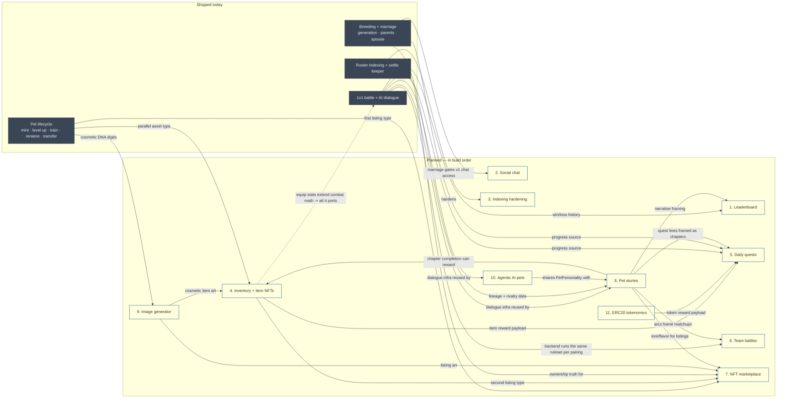

# Future features: ideas and architecture

Brainstorm doc, not a build spec. Covers eleven features the user wants to implement later:
a leaderboard, player-to-player social chat, realtime indexing hardening, NFT inventory, daily
quests, team battles, an NFT marketplace, story-based pet content, an image generator for pet
NFTs, agentic AI pets, and ERC20 tokenomics — listed here in the recommended development order
(see below), which is also the order the sections appear in below. Each section sketches where
the feature lands in the existing architecture, what new data model it needs, and the open
decisions a human should make before implementation starts. Nothing here is committed to; treat
it as a starting point for per-feature implementation plans in the style of
`plan-realtime-battle-impl.md`.

Grounded against the repo as of this writing: `backend/prisma/schema.prisma` (existing
`PetRoster`, `BattleHistory`, `BattleRoom`, `BattleDialogue`, `BattleConversation` models),
`shared/src/hooks/adapters/types.ts` (the `ChainAdapter` interface), `contracts/ethereum/src/`
(`PetCore.sol`, `GameLogic.sol`, `GameConfig.sol`, `CombatSim.sol`, `DnaLib.sol`),
`backend/src/ws/liveBattleSocket.ts` (the one existing WebSocket channel), and
`services/indexer-go/internal/`. No inventory, marketplace, token, quest, or chat surface exists yet on
either chain or in the backend — all eleven features are net-new, not extensions of something
half-built. Two doc comments in `schema.prisma` reference `PVP_BATTLE.md` and
`AI_BATTLE_DIALOGUE.md` as design docs; neither file exists in the repo today, so treat those
names as historical pointers, not sources to read.

## Cross-cutting architecture, established once so each feature section doesn't repeat it

**Licensing.** Any new Solidity or Anchor program is MIT (`contracts/ethereum`,
`contracts/solana`); any new `indexer-go` code is MIT; everything else (`backend`, `frontend`,
`mobile`, `shared`) is PolyForm Noncommercial 1.0.0. Every feature below touches both sides, so
new files must carry the license header matching whichever package they land in.

**The chain-parity discipline extends past combat.** `CombatSim.sol` / `combat.rs` /
`services/indexer-go/internal/combat` / `protocol/src/combat` are kept in sync today via golden
vectors (`contracts/test-vectors/{battle,xp}.json`). Any new feature that (a) computes a
deterministic on-chain outcome and (b) needs a client-side TypeScript port for animation or
preview inherits the same obligation: if team battles or story-chapter unlocks get a TS replay
port, they need their own golden vectors, not a "close enough" reimplementation. Features that
stay server/backend-computed (leaderboard ranking, quest progress) don't need this — only
give something a TS port if the client actually needs to simulate it before the chain confirms.

**Combat authority is moving off-chain, and that reshapes several features below.**
`docs/plan-backend-battle-architecture.md` is the accepted architecture for battle execution: the
backend resolves fights from a frozen snapshot against a versioned ruleset, seeds them from a
pre-committed drand round, and publishes signed receipts anyone can replay
(`docs/plan-backend-battle-steps.md` sequences the work). Two consequences for this doc. First, a
*new* combat mechanic is built once, in the canonical TypeScript engine (`protocol/src/combat/`,
moved out of `shared/src/utils/combat/` into the MIT `protocol` package), with the Go port
acting as an independent pre-signing verifier rather than a fourth hand-maintained implementation.
Second, the four-port rule stays a `MUST` in `AGENTS.md` until the legacy on-chain path actually
retires, so any change to *existing* combat math still updates all four ports until then.

**The settle-keeper pattern is reusable, but it is legacy for battle execution.**
`backend/src/features/settle-keeper/` (EVM) and `settle-keeper-solana/` established: async VRF
request → provider reveal → permissionless settle → a backend hot wallet sends the settle tx so the
player isn't stuck with two signatures, with a player-side fallback timer if the keeper is down.
That shape is still right for any feature whose outcome must land in chain state, such as gacha
crates minting a real item. It is the wrong shape for battles from here on: backend-resolved
battles send no transaction at all, so they need no keeper, no per-battle entropy fee, and no
settle gas. Treat the two keepers as the legacy 1v1 path, maintained until it retires, not as the
template a new battle mode should copy.

**Indexer extension pattern.** Every existing on-chain asset type (`PetRoster`, `BattleHistory`)
follows the same shape: a `(chain, id)` composite primary key, a monotonic `lastVersion` /
`version` column the upsert guards on (`WHERE last_version <= EXCLUDED.last_version`), and a
`ChainIndexer`-conforming adapter in `services/indexer-go/internal/{evm,solana}` plus a mirror path in the
backend's Node `RosterIndexer`. Items, marketplace listings, and token transfers are all new asset
types — each needs a new Prisma table shaped this way and a new case in both indexers, not a
bolt-on to `PetRoster`.

**`ChainAdapter` stays pet-action-only.** Per `AGENTS.md`, `shared/src/hooks/adapters/types.ts`
is a real, narrow interface (`createPet`, `levelUpPet`, `trainPet`, `renamePet`, `transferPet`,
`battlePets`, `breedPets`). Marketplace, inventory, and quest actions are new domains — give them
their own chain-blind adapter-shaped interfaces (e.g. `MarketplaceAdapter`,
`useMarketplaceAdapter`) rather than growing `ChainAdapter`. Reuse the *pattern* (thin interface,
per-chain implementation, a `useXAdapter()` that picks the active one), not the interface itself.

**Recommended development order.** Grouped into tiers by cost, risk, and dependency — not a flat
arbitrary list. The numbered sections later in this doc follow this exact sequence: section 1 is
what to build first, section 11 is what to build last.

*Tier 1 — ship immediately.* Near-zero new infrastructure, no contract work on either chain,
nothing else in this doc needs to exist first.
1. **Leaderboard** — `PetRoster.winCount`/`lossCount` already exist.
2. **Social chat** — reuses the existing WebSocket channel and JWT auth; v1 scope is gated by the
   marriage feature that's already shipped.

*Tier 2 — foundation.* Harden what's shipped and build the systems everything else leans on.
3. **Indexing hardening** — everything downstream trusts the indexer more once this lands.
4. **Inventory + item NFTs** (cosmetics/consumables tier) — the pivot feature other systems
   reward into.
5. **Daily quests** — needs inventory (or tokenomics, later) to have something real to reward.

*Tier 3 — depth.* Moderate contract work, each reusing patterns tier 2 or shipped features
already established.
6. **Team battles** — backend orchestration over the versioned ruleset, so this now sequences
   after the backend battle path exists (see the cross-cutting note above).
7. **Marketplace** — needs inventory to exist so there's more than pets to list.

*Tier 4 — differentiation.* The content and AI layer that makes this project distinct from a
generic breed/battle/market clone.
8. **Pet stories** — reuses the dialogue-generation infra; the narrative hub other features can
   optionally plug into.
9. **Image generator** — independent of everything else; feeds marketplace/story visuals
   whenever it lands. **Built out of order, ahead of tiers 1-3; see §9.**
10. **Agentic AI pets** — needs dialogue infra maturity and real product iteration to avoid
    feeling gimmicky.

*Tier 5 — highest risk, sequence last.*
11. **ERC20 tokenomics** — touch last, once fees/marketplace/quests exist to give a token real
    utility sinks.

Tiers 3 and 4 aren't strict lockstep with each other — features 6, 7, 8, 9, and 10 only need
their own tier-2/shipped prerequisites, not one another. Pet stories' narrative-hub hooks into
features 1, 5, 6, and 7 (see below) are additive, not blocking: build each of those features'
mechanics first, add the story hook whenever feature 8 lands.

## How these features relate to each other, and to what's already shipped

The eleven features aren't eleven independent additions — most either extend something that
already works today (pet lifecycle, 1v1 battle + dialogue, breeding/marriage, roster indexing) or
depend on another planned feature existing first. One choice shapes the whole picture: **pet
stories (feature 8) act as a narrative hub** — quests, team-battle framing, marketplace lore,
leaderboard context, and agentic AI behavior all pull content from a pet's story/journal. That
relationship is about content and framing, not mechanics: combat resolution, breeding genetics,
and XP math stay exactly as deterministic as they are today, because that determinism is what the
four-port golden-vector rule exists to protect. The one relationship that does touch that rule
directly — inventory's equip-stat sub-feature — is marked separately below.



Reading the graph:

- **Team battles reuse the fight function but are not therefore low risk.** The per-pairing math is
  the existing, vector-validated single fight, and that part is genuinely additive. Everything
  around it is not: N pairings need N sub-seeds derived from one pre-committed drand round, a
  snapshot covering every pet on both teams, consent from every defender, an aggregation rule that
  is itself part of the ruleset hash, and a receipt shape that survives replay. Authorization,
  snapshots, seed derivation, signer scope, and reward aggregation are all security-sensitive here.
  Treat this as a feature that inherits the full backend battle threat model
  (`docs/threat-model-backend-battles.md`), not as a loop around a proven function.
- **Inventory is the pivot feature.** It's a parallel asset type to pets (same ownership/indexing
  pattern), the second thing the marketplace can list besides pets, and the default reward
  payload for quests. Everything downstream of it moves faster once it exists — see feature 4
  below for why its *equip-stat* sub-feature is the one dashed edge in this graph, and why it
  should be split into its own later phase, separate from the rest of inventory.
- **Marketplace** has two prerequisites, not one: it can technically list pets on day one (`PetCore`
  already exists), but it isn't worth building until inventory gives it a second, higher-volume
  asset type to trade.
- **Agentic AI pets and pet stories should share one character model, not two.** Both consume the
  existing dialogue-generation infrastructure (Claude, generate-once caching) and both need a
  stable per-pet personality. Building `PetPersonality` once (feature 10) and having pet stories
  (feature 8) read the same record — rather than each feature inventing its own character data —
  is the difference between one coherent pet identity and two AI systems disagreeing about who a
  pet is.
- **Pet stories are a narrative hub, not a mechanical one.** Quests, team-battle matchups,
  marketplace listings, and leaderboard placement can all pull flavor text or context from a
  pet's story progress, but none of them read the story to *decide* an outcome. That distinction
  is exactly why this doesn't trigger the four-port parity rule the way inventory's equip-stats
  sub-feature does — the arrows out of `STORY` carry narrative content, not deterministic values.
  Under backend-resolved combat this hardens into a rule: AI-generated or story-derived content
  never enters a battle snapshot, a ruleset, or any other receipt input. A receipt has to be
  replayable years later by someone with no access to our model, our prompts, or our content
  tables, and a non-deterministic input makes it unreplayable.
- **Image generation feeds two other features' visuals** (marketplace listings, inventory
  cosmetic item art) but depends on nothing itself — it's the most schedule-flexible feature on
  the list precisely because of that one-way arrow direction.
- **Leaderboard and indexing hardening have no planned-feature dependencies at all** — both only
  need what's shipped today, which is why they're both in the earliest development tiers.
- **Social chat is the only feature with no chain footprint at all.** It doesn't extend any
  contract, doesn't need a new indexer asset type, and its v1 scope is gated by the marriage
  feature that's already shipped, not by any other planned feature — see feature 2 for why it's
  deliberately *not* wired into the story hub above.

---

## 1. Leaderboard feature

**Goal.** Ranked pets and/or players by battle performance.

**Design.** The cheapest feature on this list to ship: `PetRoster.winCount`/`lossCount` already
exist per pet, and `BattleHistory` already has every settled result. A leaderboard can be a
read-only backend endpoint (materialized view or a plain indexed query) over data that's already
being written today — no contract change, no new indexer work.

If raw win count feels unfair (a pet that only fights weak opponents shouldn't outrank one that
fights strong ones), consider an ELO/Glicko-style rating computed purely in the backend from the
existing `BattleHistory` stream on each new settled battle — this stays backend-only and never
needs to touch `CombatSim` or the settle contracts, since rating is a presentation-layer
derivative of an already-final on-chain result, not part of the outcome itself.

Once backend battles land, rating stops being a pure presentation derivative: it becomes part of
off-chain progression (`PetBattleProgress`) and, if it ever gates rewards, part of the replayable
`progressionDelta` in each receipt. Build one rating, in the ruleset, computed from receipts. A
second rating invented at the leaderboard layer would disagree with the receipts and neither would be
checkable.

**Data model (if ELO, else skip — win/loss counts already suffice for a naive leaderboard):**

```prisma
model PetRating {
  chain     String
  petId     String @map("pet_id")
  rating    Int    @default(1200)
  updatedAt DateTime @updatedAt @map("updated_at")
  @@id([chain, petId])
  @@map("pet_rating")
}
```

Once feature 8 exists, a leaderboard row can show a one-line story or rivalry blurb next to the
rank. The ranking computation itself is unaffected.

---

## 2. Social features: player-to-player chat

**Goal.** Real player-to-player messaging, not another AI-generated conversation. The natural
starting point is the marriage feature: two owners whose pets are married already have an
established relationship in the game — a private chat thread between them is the smallest,
most obviously-scoped version of "social features" rather than open-ended chat with strangers.

**This is the cheapest feature in the whole doc.** It's the only one that touches no contract on
either chain and needs no new indexer asset type. The backend already runs a WebSocket server
(`backend/src/ws/liveBattleSocket.ts`) and already authenticates connections via the existing
nonce → signature → JWT flow (`backend/src/features/auth/`) — a chat channel is a second use of
both, not new infrastructure. Player identity is just the authenticated wallet address, same as
everywhere else in the backend.

**Scope in tiers, don't build all of it at once:**

- **v1 — married-pet private thread.** A chat thread exists only between two owners who currently
  have a married pet pair (`PetRoster.spouseId` resolving between a pet each of them owns). This
  is deliberately the narrowest possible version: one thread type, access gated by state that
  already exists, no discovery/search surface to abuse.
- **v2 — open direct messages.** Any player can message any other player (e.g. to negotiate a
  cross-owner breed, or after a battle). This is where moderation stops being optional — see below.
- **v3 — group/guild or global chat.** Out of scope for this doc; a materially bigger moderation
  and infrastructure surface (message fan-out, channel membership, spam at a different scale) that
  deserves its own design pass if the earlier tiers show real usage.

**Data model** (no chain fields at all — the first feature in this doc without a `chain` column):

```prisma
model ChatThread {
  id           String   @id @default(cuid())
  participantA String   @map("participant_a")   // wallet address, lexicographically first
  participantB String   @map("participant_b")
  scope        String                            // 'marriage' in v1; 'direct' from v2
  createdAt    DateTime @default(now()) @map("created_at")
  @@unique([participantA, participantB])
  @@map("chat_thread")
}

model ChatMessage {
  id        Int      @id @default(autoincrement())
  threadId  String   @map("thread_id")
  sender    String
  text      String
  createdAt DateTime @default(now()) @map("created_at")
  @@index([threadId, createdAt])
  @@map("chat_message")
}
```

`ChatThread` doesn't store the marriage relationship redundantly — v1 access is checked against
`PetRoster.spouseId` at the moment a thread is opened, the same "derive from indexed state, don't
duplicate it" approach the rest of this doc uses for read-only data.

**Deliberately not wired into the story hub.** Section 8 describes pet stories pulling from
public, on-chain-derived game state (level, lineage, battle history) into narrative content. A
private conversation between two players is a different kind of data — feeding chat content into
AI-generated story material without explicit, informed opt-in would be a real trust violation,
not a feature. If a "married couple's story" angle is ever wanted, it should read from the
marriage *relationship* (already public: `spouseId`), never from message contents.

**Open decisions:** moderation (rate limiting, block/report, profanity filtering) becomes real
product and legal surface the moment genuine user-generated text exists — unlike the rest of this
doc, where "content" is AI-generated and at least somewhat controllable at the prompt layer; message
retention/deletion policy; and whether v1 should ship read receipts or online presence, or stay as
bare as possible for a first version.

---

## 3. "Perfect" indexing with realtime blockchain sync

**Goal.** Tighten the existing dual-indexer setup (Node `RosterIndexer` + optional `indexer-go`)
so both chains reflect on-chain state with minimal lag and no missed events.

**Current state, precisely:** EVM indexing is subgraph watermark polling (inherently lagged by
poll interval + subgraph indexing time); Solana is WebSocket push + backfill. There's already a
gRPC streaming path (`StreamLiveBattles`), a read-source circuit breaker (`ROSTER_READ_SOURCE`:
`grpc` vs `postgres`), and an optional write-through cache (`ROSTER_CACHE_ENABLED`) that's only
coherent while `indexer-go` is the sole writer (must stay off during shadow-mode dual-indexer
operation). The backend already has `backend/src/ws/liveBattleSocket.ts` pushing live battle
updates to the frontend.

**What "perfect" realistically means here:**
- Replace EVM subgraph polling with a direct log-subscription indexer path in
  `services/indexer-go/internal/evm` (WS/HTTP log filter on `BattleResolved`/`Transfer`/etc.), keeping
  subgraph pull as a backfill/reconciliation fallback rather than the primary path — same
  relationship Solana already has between WS push and backfill.
- A reconciliation job that periodically diffs Node-indexer state against `indexer-go` state and
  alerts on drift, so shadow-mode isn't "trust and hope."
- Reorg handling: confirmation-depth config for both chains before a write is treated as final,
  so a rolled-back EVM block or skipped Solana slot doesn't leave a phantom row.
- Once shadow-mode is validated by the reconciliation job, flip `ROSTER_READ_SOURCE=grpc` and
  enable `ROSTER_CACHE_ENABLED` by default — this is explicitly called "promotable later" in the
  current docs, so this feature is largely finishing that promotion rather than new design.

Both indexers are still live: the Node `RosterIndexer` is the source of truth in local dev and
`indexer-go` is the promotable path, so "dual-indexer" describes the current state, not a leftover.
What changes is that `indexer-go` picks up a second, unrelated job under backend-resolved combat: it
becomes the independent pre-signing verifier that recomputes every battle result before a receipt is
signed (`docs/plan-backend-battle-steps.md` Step 25). That is a release-safety role, not an indexing
role, and it does not depend on which indexer owns roster writes. Worth knowing before promotion,
because an `indexer-go` outage then blocks receipt signing as well as roster freshness, so the two
concerns need separate health signals.

Snapshot inputs are the other connection. Backend battles freeze pet state at acceptance from
indexed chain state at a recorded source version, so indexer lag and reorg handling stop being
purely cosmetic: a snapshot taken from an unfinalized write is threat T10 in
`docs/threat-model-backend-battles.md`. The confirmation-depth work above is a prerequisite for
that, not an optional polish item.

This feature has little product-design risk — it's operational hardening of a path that already
exists end-to-end — but it now sits upstream of battle correctness, not just of display freshness.

---

## 4. Inventory functionality with an NFT system

**Goal.** A large item catalog — the user's reference points are OwoBot (breadth: hundreds of
collectible/currency items, gacha crates, a constant drip of new items) and Dota 2 (depth: gear
that actually changes what a pet can do in battle, rarity-tiered cosmetics, item sets). This
repo's version should borrow the breadth from one and the depth from the other, not attempt both
at Dota's scale on day one.

**Catalog size is a content problem, not a contract problem.** ERC-1155 (and the SPL equivalent)
store only a numeric item-type ID on-chain; name, art, and effect data live in metadata off-chain.
Whether the catalog has 20 items or 2,000 costs the same on-chain — it's `backend`/content work to
define them, not a gas or storage concern. Don't let "so many items" turn into a reason to
over-engineer the contract; it's a reason to build a good off-chain item-definition table with
room to grow.

**Item taxonomy — five categories, each with a different chain footprint:**

| Category | Example | On/off-chain effect | Combat-port risk |
|---|---|---|---|
| Consumable | XP potion, cooldown reset, fertility charm | Burned on use via a `GameLogic`-style `useItem(petId, itemId)` call; effect applies immediately (grants XP, clears a timer) | None — same shape as `trainPet` |
| Equipment / gear | Weapon, armor, trinket — Dota-style, one per slot | **Persistent**, equip/unequip, grants a stat modifier while equipped | **No new ports** for backend battles, but snapshot verifiability applies — see below |
| Cosmetic / skin | Recolor, hat, aura — Dota-style, visual only | Persistent, equip/unequip, no stat effect | None |
| Collectible / currency | Crate keys, event tokens, badges — OwoBot-style | Tradeable, stackable, no direct effect; gacha-crate inputs | None |
| Crafting material | Combine N materials into an item | Burned on craft, mirrors item minting | None |

Rarity should reuse the game's existing five-tier system verbatim
(`shared/src/utils/pets/cosmetics.ts`: Common/Uncommon/Rare/Epic/Legendary, matching `DnaLib`'s
50/25/15/8/2 pet-rarity split) rather than inventing a separate item-rarity scale — one rarity
vocabulary across pets and items keeps the UI (and the player's mental model) consistent.

**The one edge that matters: equipment stats and verifiable snapshots.** The cost here changed with
backend-resolved combat. Gear that only affects backend battles needs **no Solidity or Rust
implementation and no fourth port**: the modifier is an input to the versioned TypeScript ruleset,
with the Go verifier recomputing it before signing. That removes most of what made this expensive.

What replaces it is a verifiability requirement, and it is not weaker. A geared fight is only
replayable by an outsider if the gear is part of the frozen snapshot and the snapshot's inputs are
checkable. So:

- Equipment ownership must be verifiable at snapshot time from chain state at a recorded source
  version, exactly like pet ownership. Backend-only equip state that no third party can confirm
  turns every geared receipt into an assertion (threat T13 in
  `docs/threat-model-backend-battles.md`).
- The snapshot carries the resolved modifiers, not a reference to a mutable item row. Unequipping
  after acceptance must not change a committed fight, the same reason pet stats are frozen.
- `ItemDefinition.effect` becomes part of the ruleset hash if it feeds combat. A rebalance is then a
  new `rulesetVersion`, historical receipts keep replaying against the pinned old bundle, and
  outstanding defence authorizations bound to the old ruleset are invalidated by design.

Recommendations:

- Ship consumables, cosmetics, and collectibles first — none of them touch combat math, so
  they're purely additive to `backend` + the new `ItemCore` contract.
- Scope "equipment affects battle" as its **own separate phase**, gated behind an explicit design
  review (per CLAUDE.md's rule that game-balance calls aren't for an agent to loop on alone) —
  decide slot count, whether stats are additive or multiplicative, and how equip state is proven at
  snapshot time.
- If gear must also affect the legacy on-chain 1v1 path, the four-port cost returns in full. Prefer
  gating gear to backend battles until that path retires.
- Keep the modifier model simple when it lands (flat additive bonuses to existing `Attrs` fields
  in `DnaLib.extract`-shaped output) — a small, closed modifier space is what keeps four
  independent ports and one vector file tractable. A multiplicative or conditional (set-bonus,
  Dota-style) effect system multiplies the vector matrix combinatorially; treat that as a v2 of
  the equipment system, not the v1.

**Chain-specific contracts:** EVM gets a new `ItemCore.sol` as ERC-1155 (semi-fungible — many
players own the same potion, unlike a pet's one-of-one `ERC-721`). Solana: an SPL Token-2022 mint
per item type is the closer semantic match to "many of the same item" than a compressed-NFT
collection. Start EVM-first, matching this repo's existing EVM-first pattern for new systems,
and validate the item/equip model there before porting to Solana.

**Gacha crates (the OwoBot-breadth mechanic).** Reuse the existing async-VRF infrastructure
rather than inventing new randomness: `openCrate(crateId)` → Pyth Entropy / Switchboard reveal →
permissionless settle mints the rolled item, exactly the settle-keeper shape already built for
battle/breed/mint. This keeps crate openings provably fair using infrastructure that already
exists, instead of a second randomness system to maintain.

**Data model** (extends the earlier sketch with equip state and item definitions):

```prisma
model ItemDefinition {
  id          String @id                    // stable item-type key, e.g. 'xp_potion_i'
  category    String                        // 'consumable' | 'equipment' | 'cosmetic' | 'collectible' | 'material'
  slot        String?                       // equip slot, null unless category = 'equipment'/'cosmetic'
  rarity      Int                           // 1-5, same scale as pet rarity
  effect      Json?                         // modifier payload for equipment; null otherwise
  name        String
  description String
}

model ItemRoster {
  chain        String
  itemId       String   @map("item_id")     // token id (EVM) / mint (Solana)
  owner        String
  itemType     String   @map("item_type")   // -> ItemDefinition.id
  quantity     Int
  lastVersion  BigInt   @default(0) @map("last_version")
  updatedAt    DateTime @updatedAt @map("updated_at")
  @@id([chain, itemId, owner])
  @@map("item_roster")
}

model PetEquipment {
  chain     String
  petId     String @map("pet_id")
  slot      String                          // 'weapon' | 'armor' | 'trinket' | 'cosmetic'
  itemId    String @map("item_id")
  equippedAt DateTime @default(now()) @map("equipped_at")
  @@id([chain, petId, slot])
  @@map("pet_equipment")
}
```

**Open decisions:** exact slot count and names (the sketch above uses three gear slots plus one
cosmetic slot, arbitrary pending design input); whether `ItemDefinition` content is owner-tunable
on-chain (immutable, expensive to rebalance) or backend-managed (cheap to rebalance, matches the
existing `GameConfig` pattern of keeping balance knobs off-chain and owner-tunable at that layer);
and — the big one — whether equipment-affects-combat ships at all in v1. That call is now about
snapshot verifiability and ruleset versioning rather than four-port cost, and it is cheaper than it
used to be, but it is still a phase of its own.

---

## 5. Daily quest feature

**Goal.** Rotating daily objectives (e.g. "win 3 battles," "train 2 pets") with rewards.

**Design.** Backend-only feature, no contract changes required for progress tracking — quest
completion can be derived by watching the same events the indexer already ingests
(`BattleHistory` rows, a new `trainPet` event count, etc.), so this stays purely additive to
`backend`. Needs a daily-boundary reset, which should be a plain scheduled job in the backend
(e.g. `node-cron`, or a lazy day-boundary check computed at read time) — not this assistant's own
`CronCreate`/scheduled-agent tooling, which is unrelated infrastructure for Claude Code itself.

Reward path is the one open dependency: a reward has to be *something*. Until feature 4
(inventory) or feature 11 (tokenomics) exists, quests can only grant off-chain points with no
redemption value. Sequencing quests after inventory (reward = item NFT) is the lowest-friction
path; token rewards can follow once tokenomics exists.

Once feature 8 exists, a quest line can be framed as chapters in a pet's arc ("Chapter 3: Prove
your worth — win 3 battles") instead of a flat checklist. The completion criteria and reward
payload underneath don't change; only the presentation borrows from the story system.

**Data model:**

```prisma
model DailyQuest {
  id            String @id @default(cuid())
  description   String
  requirement   String            // e.g. 'battle_win_count', 'train_count'
  target        Int
  rewardType    String @map("reward_type")   // 'item' | 'points' | 'token' (as later features land)
  rewardPayload Json   @map("reward_payload")
  activeDate    DateTime @map("active_date")
}

model PlayerQuestProgress {
  address    String
  questId    String   @map("quest_id")
  progress   Int      @default(0)
  claimedAt  DateTime? @map("claimed_at")
  @@id([address, questId])
}
```

---

## 6. Team battle functionality

**Goal.** N-vs-N pet battles (e.g. best-of-3 or best-of-5 pairings) instead of 1v1, aggregating
to a single winner.

**Design.** This is a backend feature now, not a contract feature. The earlier sketch here was a
`TeamBattleManager` contract on each chain calling the on-chain single-fight function once per
pairing; that multiplies exactly the per-battle gas the backend battle architecture exists to
remove, so it is superseded. Build team battles as orchestration inside the versioned ruleset: one
accepted team battle, one snapshot covering every pet on both teams, one pre-committed drand round,
N pairings resolved by the same single-fight function, aggregated into a team result, one signed
receipt.

What is genuinely reused is the fight function. What is new, and needs specifying rather than
assuming:

- **Sub-seed derivation.** One beacon value seeds N fights, so each pairing takes a domain-separated
  sub-seed (`battleSeed` plus pairing index) rather than reusing one seed or fetching N rounds.
  Deriving this wrong is the whole feature's correctness.
- **Aggregation is part of the ruleset.** Pairing order, early termination, and tie-breaks feed
  `rulesetHash`, so a change to them is a ruleset version bump, not a config edit.
- **Consent scales with team size.** Every defending pet's owner must have a valid
  `DefenseAuthorization`, and one revoked authorization invalidates the whole match rather than one
  pairing.
- **Snapshot size.** Freezing 10 pets instead of 2 makes the snapshot the largest receipt field.
  Decide whether the receipt carries full snapshots or a snapshot hash plus a separately published
  snapshot blob before the shape is frozen.
- **Golden vectors** for aggregation and sub-seed derivation, alongside the protocol vectors, since
  the client replays team battles for animation too.

No `requestTeamBattle`, no reveal, no settle transaction: a backend team battle sends nothing
on-chain, and rewards flow through the same aggregated claim path as 1v1.

**Data model.** Not a mirror of `BattleHistory` any more. `BattleHistory` is an ingested projection
of on-chain events, and a backend team battle produces no event to ingest. Team battles extend the
battle ledger models instead (`BattleLedger`, `BattleCommitment`, `BattleReceipt`), most likely as a
battle kind plus a team-composition table, so they inherit the state machine, the commitment chain,
and the receipt chains rather than reimplementing them. The sketch below is kept only as a shape
reference for what a team result holds:

```prisma
model TeamBattleHistory {
  chain            String
  teamBattleId     String   @map("team_battle_id")
  attackerTeam     Json     @map("attacker_team")   // pet id[]
  defenderTeam     Json     @map("defender_team")
  matchResults     Json     @map("match_results")   // per-pairing outcome, in order
  winnerSide       String   @map("winner_side")      // 'attacker' | 'defender'
  foughtAt         BigInt   @map("fought_at")
  version          BigInt   @default(0)
  @@id([chain, teamBattleId])
  @@map("team_battle_history")
}
```

**Open decisions (human call, per CLAUDE.md's guidance on game-balance):** team size, whether
pets can be reused across multiple team slots' cooldowns, pairing order (fixed vs. player-chosen
vs. random), and whether a mid-team loss ends the match early or all pairings always resolve. Note
that pairing order and early termination are no longer purely balance knobs: they are ruleset inputs,
so each answer is baked into a `rulesetVersion` and outstanding defence authorizations are
invalidated when it changes.

Once feature 8 (pet stories) exists, a team match can pull a narrative title from the two teams'
story progress — framing a repeat matchup as a rivalry chapter, say — as pure display copy with
no effect on pairing order or resolution.

---

## 7. NFT marketplace for pets and inventories

**Goal.** List and trade pet NFTs and item NFTs (feature 4) for a fee.

**Design.** New `Marketplace.sol` (EVM): escrow- or approval-based listing/buy/cancel, supporting
both `PetCore` (ERC-721) and `ItemCore` (ERC-1155) as listed asset types. Solana: a custom Anchor
program with an escrow PDA per listing (Metaplex Auction House is an option if its fee/royalty
model fits, otherwise a minimal custom program mirroring the EVM one keeps behavior parity
easier to reason about). Fee should be an owner-tunable basis-points value, following the same
pattern as `GameConfig.battleFee`.

Escrow contracts are a classic exploit surface (reentrancy on withdraw, stale-approval races,
double-listing). This is the one feature on this list that most warrants a dedicated security
review pass (`/security-review`) before any mainnet deployment, independent of the general
launch-readiness bar for the rest.

**Data model:**

```prisma
model MarketplaceListing {
  chain       String
  listingId   String  @map("listing_id")
  assetType   String  @map("asset_type")   // 'pet' | 'item'
  assetId     String  @map("asset_id")
  seller      String
  price       String              // wei/lamports as string, same convention as `dna`
  status      String              // 'open' | 'sold' | 'cancelled'
  lastVersion BigInt  @default(0) @map("last_version")
  updatedAt   DateTime @updatedAt @map("updated_at")
  @@id([chain, listingId])
  @@map("marketplace_listing")
}
```

**Frontend:** a new `MarketplaceAdapter`-shaped interface (list, buy, cancel), not an extension of
`ChainAdapter` — per the cross-cutting note above, this is a distinct domain from pet actions.

Once feature 8 exists, a listing can surface a pet's unlocked story chapters as flavor copy —
presentation only, no effect on price, escrow, or listing mechanics.

---

## 8. Pets story-based gaming utility

**Goal.** Narrative content gated by pet progression, giving payoff to fields that already exist
but are currently just data: `generation`, `parent1Id`/`parent2Id`, `spouseId`, `speciesId`, plus
`BattleHistory`'s head-to-head record. This is explicitly the feature that can turn those fields
— already noted in memory as "much mock richness is unbacked game-fantasy" in the redesign
context — into functionality a player actually experiences, instead of decorative data.

**Design — reuse the dialogue infra, don't parallel it.** The dialogue feature already
establishes the right pattern: `backend/src/features/dialogue/` generates text via Claude, caches
it per key so it's billed and generated exactly once (`BattleDialogue`), and keeps an append-only
transcript for continuity (`BattleConversation`, keyed by fighter pair, already reused across
multiple battles between the same two pets). A new `backend/src/features/pet-story/` should sit
on the same foundation rather than standing up a second generation pipeline.

**Story as the narrative hub other systems pull from.** This is the feature the user wants "other
game logic based on" — the shape that fits without breaking anything is a *narrative hub*, not a
mechanical one. Concretely:

- **Daily quests (5)** get framed as chapters in a pet's arc ("Chapter 3: Prove your worth — win 3
  battles") instead of a flat checklist. Completion criteria and reward payload are unchanged.
- **Team battles (6)** can pull a narrative title for a matchup — a repeat opponent framed as a
  rivalry chapter, say. Pairing order and match resolution are unchanged.
- **Marketplace (7)** listings can surface a pet's unlocked chapters as flavor copy. Price, escrow,
  and listing mechanics are unchanged.
- **Leaderboard (1)** rows can show a one-line story/rivalry blurb next to a rank. The ranking
  computation is unchanged.
- **Agentic AI pets (10)** read the same `PetPersonality` record and can reference unlocked story
  beats in their proposals and journal entries, so an agent's suggestions sound like they come
  from the same character the story is telling, not a second, inconsistent voice.

What stays fixed regardless of how deep this hub goes: combat resolution, breeding genetics, and
XP math never take narrative content as an input. That boundary is what keeps the four-port
golden-vector rule meaningful — a story chapter can *describe* why a pet won, never *decide* it.
If a later phase wants a chapter to gate an actual mechanical unlock (not just narrate one — say,
a stat change rather than an item reward), that's a deliberate escalation past "narrative hub" and
deserves its own design review at the time, not a default this doc assumes.

**Three chapter categories, each keyed off data that already exists:**

- **Milestone chapters** — gated on level thresholds or `generation` (a gen-3 pet's origin story
  differs from a gen-0 starter's). Single trigger, single chapter, simplest case.
- **Lineage sagas** — `parent1Id`/`parent2Id` already form a real ancestry graph once breeding is
  used. A saga chapter can pull a pet's parents' (and, transitively, grandparents') own unlocked
  chapters into its prompt context, so a bred pet's story is explicitly framed as a continuation
  of its parents', not a fresh unrelated narrative. `spouseId` extends this into a paired
  "family" arc for two married pets.
- **Rivalry chapters** — `BattleHistory`'s head-to-head data (already consumed by the dialogue
  feature for banter context) is enough to detect a real rivalry (repeated fights between the
  same two pets, a lopsided or close win/loss record) and generate a "nemesis" chapter arc keyed
  to that specific opponent, rather than a generic battle-count milestone.

**Share `PetPersonality` with feature 10, don't fork it.** If agentic AI pets ships a persistent
personality profile, pet stories should read that same record for tone/voice rather than each
feature independently inventing how a given pet "sounds." Concretely: `PetPersonality` (traits,
generated once) is written by whichever feature ships first, and both dialogue-adjacent features
— battle banter, agent journal entries, story chapters — treat it as a shared read dependency.
This is the difference between one coherent character per pet and two AI systems that occasionally
contradict each other about the same pet's personality.

**Branching is optional and should start cosmetic-only.** A chapter can end in a player choice
that affects which chapter unlocks next (`choices` stored per progress row) without that choice
ever touching game mechanics — pure-narrative branching is low-risk and ships independently of
every other feature on this list. Only if a chapter completion should *grant* something (a
cosmetic item, say) does this feature pick up a dependency on feature 4's inventory system; keep
that as an explicit later extension, not a v1 requirement.

**Data model:**

```prisma
model PetStoryProgress {
  chain      String
  petId      String   @map("pet_id")
  chapterId  String   @map("chapter_id")   // maps to a static chapter-definition table
  generated  String                        // cached chapter text, billed once
  choices    Json?                         // player branching choices made in this chapter, if any
  unlockedAt DateTime @map("unlocked_at")
  @@id([chain, petId, chapterId])
  @@map("pet_story_progress")
}
```

**Open decisions:** whether lineage sagas require *both* parents to have already unlocked their
own origin chapter before a child's saga chapter can generate (richer, but adds an ordering
dependency to breeding-heavy playstyles), and whether rivalry chapters regenerate if the head-to-
head record changes significantly after the chapter was first cached (mirrors the same
generate-once-vs-freshness tradeoff `BattleDialogue` already made in favor of "generate once").

---

## 9. Image generator system for pet NFTs

> **Built.** This section is kept as the original proposal; `services/image-generator/` is the
> implementation and its README is authoritative. What shipped diverges from the
> recommendation below in several deliberate ways, recorded here so they are not
> mistaken for drift:
>
> - **Generative AI, not procedural.** The design below argued for procedural SVG
>   layering. The build uses Cloudflare Workers AI (SDXL-Lightning by default),
>   chosen for art quality. The objection the proposal raised is real and was
>   answered rather than ignored: diffusion output is *not* reproducible from DNA
>   across model versions, so an image is generated once and written to immutable
>   storage keyed on `(dna, rarity, speciesId)`, and regeneration is an explicit
>   `ART_VERSION` bump. DNA -> traits -> prompt stays exact integer math; only the
>   last step is non-deterministic.
> - **R2, not IPFS/Arweave.** Same Cloudflare account as the model, no egress fees.
>   The store is a two-method interface, so an IPFS pin can be added without
>   touching the pipeline.
> - **A standalone service, not a library.** `services/image-generator/` is deliberately not
>   a pnpm workspace member; see CLAUDE.md.
> - **Cosmetic digits alone were not enough.** Pair 6 is already spent on species at
>   mint time and pair 7 gives only 100 looks, so the HP and INT genes also nudge
>   proportions. Art reads DNA and never feeds back into combat.
> - **Cross-chain parity, as flagged below, did surface** — but as a Solana-specific
>   rule rather than a golden vector: `species_id` is `0` there until species pools
>   land, and must be read as *unset* or every Solana pet gets one silhouette. No
>   trait-vector fixture exists, because the derivation lives in one TypeScript
>   implementation rather than being ported per chain.

**Goal.** Unique visual art per pet instead of static per-rarity/species art.

**Grounding:** `DnaLib.sol`'s doc comment already reserves DNA digit pair 6-7 as "cosmetic
(appearance, species index — unused by combat)" — trait-driven visuals are already anticipated
in the DNA encoding, just not rendered yet.

**Design.** Recommend procedural-first, not a generative-AI call per pet: derive visual trait
layers deterministically from the existing cosmetic DNA digits (same `DnaLib.extract`-style
derivation, just for appearance instead of combat stats) and composite them client- or
server-side (SVG/canvas layering). This keeps art fully deterministic and reproducible from DNA
alone, with no per-pet inference cost, no moderation risk, and no dependency on an external image
API's uptime for a core NFT asset. An AI-generated pass (style transfer, upscaling) can be layered
on top of the procedural base later as an enhancement, cached content-addressed by DNA hash so
it's generated once and reused (same "generate-once cache" shape as `BattleDialogue`) rather than
regenerated per view.

Store the generated asset + metadata JSON on IPFS or Arweave, matching NFT ecosystem norms, with
`tokenURI` (EVM) / the Solana asset's metadata pointing at it.

**Cross-chain parity concern:** if the cosmetic DNA digit layout ever needs to match between EVM
and Solana pet minting (so the same DNA produces the same look on both chains), that derivation
needs the same golden-vector discipline as combat — a small, explicit trait-vector fixture, not
an assumption that both chains agree by construction.

---

## 10. Agentic AI-based pets feature

**Goal.** Pets with persistent personality that can propose or take autonomous actions, building
on the existing AI battle-dialogue feature.

**What already exists:** `backend/src/features/dialogue/` generates battle banter via Claude,
cached generate-once per battle (`BattleDialogue`) plus an append-only per-fighter-pair transcript
for narrative continuity (`BattleConversation`), gated so a given battle's dialogue is billed at
most once. This is the seed to build on rather than a parallel system to invent.

**Design.** A new `backend/src/features/pet-agent/` service giving each pet a persistent
personality profile and journal, using the Claude API's tool-use loop (Tool Runner or a manual
loop — see the `claude-api` skill for current SDK shape) restricted to a narrow, explicitly-scoped
tool set: propose a training session, suggest a rename, propose a breeding match. Custody must
stay with the player wallet — the agent proposes, the player's own wallet signs, exactly like
today's non-agentic flows. Do not let the agent hold signing authority or spend funds
autonomously; that's a different, much higher-risk feature than "AI personality," and should be
a separate explicit decision if ever pursued.

**Memory: build it on the per-pet receipt chain, don't invent a second one.** An agentic pet is
only interesting if it has continuity, and continuity needs a bounded, ordered view of one pet's
past. [plan-backend-battle-architecture.md](./plan-backend-battle-architecture.md) §G already
produces exactly that: every battle receipt links to the previous receipt involving that same pet
(`attackerProgressPrevReceiptHash` / `defenderProgressPrevReceiptHash`), with `PetBattleProgress`
holding the head pointer. Walking that link is the retrieval query this feature needs, already
built and already signed. Two consequences worth taking deliberately:

- Prompt context should be assembled from signed receipts, not from a mutable log. When a pet
  references a past win, that reference resolves to a receipt hash a third party can verify,
  rather than to a row the operator could have written after the fact.
- The `PetProgressCheckpoint` that keeps verification cost bounded doubles as compacted agent
  memory: cumulative state plus notable events, signed, at a fixed cadence. One artifact, both
  jobs. Do not build a separate summarisation path for the agent.

**The hard rule: agent output never enters the battle receipt chain.** The receipt chain is
valuable only because it is replayable, meaning the same snapshot, seed, and ruleset produce the
same result on any machine, forever. LLM output is not reproducible: temperature, model version,
provider-side changes, and prompt drift all break it. Hashing a generated journal entry into a
battle receipt would break public replay at that link and take down everything chained after it,
which is the one mechanism that keeps the backend operator honest. This is the same boundary as
the "narrative is a hub, not a mechanism" note above, applied to the data structure.

So: two chains, referencing in one direction only.

```text
BattleReceipt chain      deterministic, replayable, publicly verifiable
        ^
        |  referenced by hash (facts anchor narrative)
        |
PetAgentJournal chain    signed, append-only, timestamped
                         attested, NOT replayable
```

Journal entries reference receipt hashes. Receipts never reference journal entries. A signed but
non-replayable entry still earns its place: it proves what was published, when, and from which
facts, which is what continuity and tamper-evidence need. It just cannot claim correctness, and
should not be presented as though it does.

Keep the two in separate tables regardless: journal entries are large where receipts are small,
and receipts are meant to be fully public for replay while a pet's journal may reasonably be
gated to its owner.

**Data model:**

```prisma
model PetPersonality {
  chain      String
  petId      String  @map("pet_id")
  traits     Json               // stable, generated once at mint or first interaction
  updatedAt  DateTime @updatedAt @map("updated_at")
  @@id([chain, petId])
  @@map("pet_personality")
}

/// Append-only, hash-linked per pet. Signed for tamper-evidence, but NOT
/// replayable — see the two-chain rule above. Never referenced by a battle
/// receipt.
model PetAgentJournal {
  id            Int      @id @default(autoincrement())
  chain         String
  petId         String   @map("pet_id")
  entry         String             // free text, generated
  entryHash     String   @map("entry_hash")
  prevEntryHash String?  @map("prev_entry_hash")   // null for a pet's first entry
  sourceReceipts Json    @map("source_receipts")   // battle receipt hashes in context
  model         String                              // Claude model id, or 'fallback'
  promptVersion String   @map("prompt_version")
  signingKeyId  String   @map("signing_key_id")
  signature     String
  createdAt     DateTime @default(now()) @map("created_at")
  @@index([chain, petId])
  @@map("pet_agent_journal")
}
```

`model` and `promptVersion` are not bookkeeping. Without them, a model upgrade silently changes a
pet's voice and there is no way to tell whether an old entry reflects the pet's character or a
since-replaced prompt. `BattleDialogue.model` already records the first half of this today.

**Open decisions (explicitly a human/product call, not one to loop on autonomously):** how
autonomous the agent gets (suggestion-only vs. auto-executing free actions like training),
per-pet or per-owner LLM call budget/rate limits, and whether the journal chain is public
alongside the receipt corpus or gated to the pet's owner.

One decision that was previously listed as open should now be treated as closed: **personality
must not influence battle or training outcomes.** Beyond the cross-language parity cost noted
before, a trait that modifies a stat makes combat depend on generated content, so the ruleset
stops being a pure function of published inputs and public replay dies. Reopening it means giving
up the backend battle architecture's verifiability, which is a much larger trade than a flavor
decision.

---

## 11. ERC20 tokenomics

**Goal.** A utility/governance token usable for battle fees, training fees, marketplace fees,
quest rewards, and breeding stud fees.

**Design.** Follow the existing cross-chain philosophy stated in `AGENTS.md`/`CLAUDE.md`: chains
are deliberately not bridged or unified beyond the thin `ChainAdapter`. Recommend an independently
minted token per chain (standard OpenZeppelin ERC20 on EVM, SPL Token-2022 on Solana) rather than
a bridged single-supply token — a bridge is a large, high-risk undertaking this repo's existing
architecture gives no precedent for, and isn't needed for a single-game utility token.

Utility sinks should replace or supplement the current native-currency fees: `GameConfig.battleFee`
and the Solana `GlobalState.battle_fee_lamports` are ETH/SOL today; a token option would need
either a dual-payment path or a full migration, which is itself a real design decision, not a
default. Note that both battle fees exist to fund the settle keeper's own gas, so they disappear
along with the legacy path: a backend battle sends no transaction and has no gas to fund. Do not
plan a token sink around a fee that is scheduled to be removed. Breeding, minting, marketplace fees,
and item crafting are the durable sinks.

**This is the highest-risk feature on this list from a game-balance standpoint.** Emission rate,
reward amounts, and fee levels are exactly the kind of judgment call CLAUDE.md says not to loop on
autonomously — token design should be scoped and reviewed by the user explicitly before any
contract is written, not inferred from this doc. It also carries more real-world legal/compliance
surface than an NFT-only game (a fungible token with market value), which is out of scope for an
architecture doc but worth flagging before committing to it.

Sequencing last (after quests, marketplace, fees exist) means the token has real utility sinks
from day one instead of shipping with nothing to spend it on.
